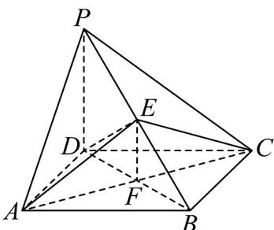

> [!faq]- 《专题21_立体几何初步及复数精选压轴60题12类考点专练_期中复习专项》官方解析
>
> > [!success]- **【答案】** (1)证明见解析 (2) $50\pi$ (3)点 $E$ 是 $PC$ 的中点.
>
> > [!note]- **【分析】**
> > （1）应用线面垂直判定定理得出 $AC \perp$ 平面 $PDB$ ，再结合面积的最小值得 $EF = 3$ ，最后再应用
> >
> > 线面垂直判定定理证明；
> >
> > (2) 先补形再应用长方体外接球性质计算求解；
> >
> > (3) 应用线面垂直判定定理得出 $BC \perp$ 平面 $PCD$ ，再结合几何体特征得出 $DE \perp$ 平面 $PBC$ ，即可证明几
> >
> > 何体形状.
>
> > [!note]- **【解析】**
> > （1）因为四边形ABCD是菱形，所以 $AC \perp BD$ ，
> >
> > 又因为 $PD \perp$ 平面 $ABCD$ , $AC \subset$ 平面 $ABCD$ , 所以 $PD \perp AC$
> >
> > 且 $BD \cap PD = D$ ， $BD, PD \subset$ 平面 PDB，所以 $AC \perp$ 平面 PDB；
> >
> > 设 AC 与 BD 相交于点 F ，连接 EF ，又由 $AC \perp$ 平面 PDB ， $EF \subset$ 平面 PBD ，
> >
> > 所以 $AC \perp EF$ ， $S_{\triangle ACE} = \frac{1}{2} AC \cdot EF$ ；
> >
> > 当 $\triangle AEC$ 面积最小时，EF 最小，则 $EF \perp PB$ ，
> >
> > $S_{\triangle ACE}=9$ ， $\frac{1}{2}\times6\times EF=9$ ，解得：EF=3；
> >
> > 由 $PB \perp EF$ 且 $PB \perp AC$ ， $EF \cap AC = F$ ， $EF$ 、 $AC \subset$ 平面 $AEC$
> >
> > 则 $PB \perp$ 平面 $AEC$ ，又 $EC \subset$ 平面 $AEC$ ，则 $PB \perp EC$ ；
> >
> > 又由 $EF = AF = FC = 3$ ，则 $EC\perp AE$ ，而 $PB\cap AE = E$
> >
> > $PB$ 、 $AE \subset$ 平面 $PAB$ ，故 $EC \perp$ 平面 $PAB$
> >
> > 
> >
> > (2) 把四棱锥 P-ABCD 放置在长方体中，
> >
> > 则长方体的外接球即为四棱锥的外接球，
> >
> > $\because PD = 5\quad CD = 4\quad AD = 3$
> >
> > ∴ 长方体的对角线长为 $\sqrt{5^{2}+4^{2}+3^{2}}=5\sqrt{2}$
> >
> > 则长方体的外接球的半径 $R=\frac{5\sqrt{2}}{2}$
> >
> > 该阳马的外接球的表面积为 $S = 4\pi R^2 = 4\pi \cdot \left(\frac{5\sqrt{2}}{2}\right)^2 = 50\pi$
> >
> > (3) 点 $E$ 是 $PC$ 的中点，
> >
> > 因为 PD = CD ，所以 $DE \perp PC$
> >
> > 又因为 $PD \perp$ 底面 ABCD ， $BC \subset$ 底面 ABCD ，所以 $BC \perp PD$
> >
> > 又 $BC \perp CD$ ， $PD \cap CD = D$ ， $PD, CD \subset$ 平面 $PCD$ ，所以 $BC \perp$ 平面 $PCD$ ，
> >
> > 又 $DE, PC \subset$ 平面 $PCD$ ，所以 $BC \perp DE, BC \perp PC$
> >
> > 由 $DE \perp PC$ ， $BC \perp DE, PC \cap BC = C$ ， $DE, BC \subset$ 平面 PBC，
> >
> > 所以 $DE \perp$ 平面 PBC ，又 $BE \subset$ 平面 PBC ，所以 $DE \perp BE$
> >
> > 所以 $\angle DEC = \angle DEB = \angle BCD = \angle BCE = \frac{\pi}{2}$ ，
> >
> > 所以四面体 E-BCD 为鳖臑；
