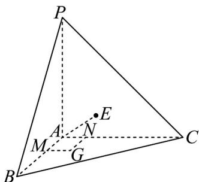

> [!faq]- 《专题21_立体几何初步及复数精选压轴60题12类考点专练_期中复习专项》官方解析
>
> > [!success]- **【答案】** (1)证明见解析； (2) $\frac{\sqrt{6}\pi}{3}$
>
> > [!note]- **【分析】**
> > （1）利用面面垂直的性质、线面垂直的性质判定推理得证.
> >
> > (2) 利用等体积法求出点 $A$ 到平面 $PBC$ 的距离，确定点 $E$ 在侧面 $PBC$ 及内部的轨迹，利用球面的性质
> >
> > 求解.
>
> > [!note]- **【解析】**
> > （1）在平面 $ABC$ 内取与点 $A$ 不重合的点 $G$ ，在此平面内作 $GM \perp AB, GN \perp AC$ 于 $M, N$
> >
> > 由平面 $PAB \perp$ 平面 ABC ，平面 $PAB \cap$ 平面 ABC = AB ，得 $GM \perp$ 平面 PAB ，
> >
> > 而 $PA \subset$ 平面 $PAB$ ，则 $PA \perp MG$ ，同理 $PA \perp GN$ ，而 $GM \cap GN = G, GM, GN \subset$ 平面 $ABC$ ，
> >
> > 所以 $PA \perp$ 平面 ABC.
> >
> > 
> >
> > (2) 由平面 $PAC \perp$ 平面 $PAB$ , 平面 $PAB \perp$ 平面 $ABC$ , 平面 $PAC \perp$ 平面 $ABC$
> >
> > 得直线 $AB, AC, AP$ 两两垂直，由 $AP = AB = AC = \sqrt{2} AE = 1$ ，得 $BC = PB = PC = \sqrt{2}$
> >
> > $S_{\triangle PBC}=\frac{\sqrt{3}}{4}BC^{2}=\frac{\sqrt{3}}{2}$ ，令点A到平面PBC的距离为d，由 $V_{A-PBC}=V_{P-ABC}$ ，
> >
> > 得 $\frac{1}{3} S_{\triangle PBC}\cdot d = \frac{1}{3}\cdot \frac{1}{2} AB\cdot AC\cdot AP$ ，则 $d = \frac{\sqrt{3}}{3}$
> >
> > 由 $AE = \frac{\sqrt{2}}{2}$ ，得点 $E$ 的轨迹是以点 $A$ 为球心， $\frac{\sqrt{2}}{2}$ 为半径的球面，
> >
> > 又点 E 在侧面 PBC （含边界）上运动，因此点 E 的轨迹是球 A 被平面 PBC 所截小圆在 $\triangle PBC$ 及内部，
> >
> > 此小圆半径 $r = \sqrt{AE^2 - d^2} = \frac{\sqrt{6}}{6}$ ，而正 $\triangle PBC$ 的内切圆半径为 $\frac{1}{3} BC\sin 60^{\circ} = \frac{\sqrt{6}}{6}$
> >
> > 所以点 $E$ 的轨迹是正 $\triangle PBC$ 的内切圆，轨迹长度为 $\frac{\sqrt{6}\pi}{3}$
> >
> > 题型十二 立体几何的综合性问题（共5小题）
