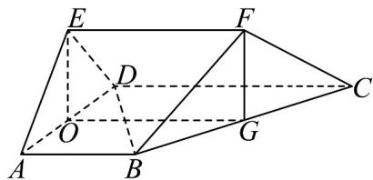
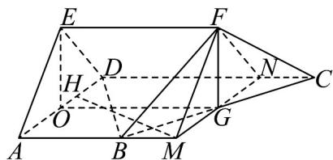

> [!faq]- 《专题21_立体几何初步及复数精选压轴60题12类考点专练_期中复习专项》官方解析
>
> > [!success]- **【答案】** (1)证明见解析(2)证明见解析(3) $\frac{9}{2}$
>
> > [!note]- **【分析】**
> > （1）通过线面平行的判定定理，先证 $AB / /$ 平面 $CDEF$ ，再由交线性质得 $AB / / EF$ ，结合线面
> >
> > 平行判定得 $EF$ // 平面 $ABCD$ ；
> >
> > (2) 先由正三角形和余弦定理求出 $CD = 4$ ，再由勾股定理得 $BD \perp BC$ ，结合 $BD \perp BF$ 证得 $BD \perp$ 平面
> >
> > BCF，从而得平面 $ABCD \perp$ 平面 BCF，再通过中位线和平行四边形证得 $EO \perp$ 平面 ABCD，进而得平面
> >
> > $AED \perp$ 平面 ABCD ;
> >
> > (3) 通过作辅助线构造三棱柱，利用平行四边形和线面垂直关系求出高，再计算三棱柱体积，最后说明
> >
> > 三棱锥体积相等，得出五面体体积.
>
> > [!note]- **【解析】**
> > （1）因为 $AB \parallel CD, AB \not\subset$ 平面 $CDEF, CD \subset$ 平面 $CDEF$ ，所以 $AB \parallel$ 平面 $CDEF$ ，
> >
> > 又因为 $AB \subset$ 平面 ABEF 且平面 $ABEF \cap$ 平面 CDEF = EF
> >
> > 所以 $AB \parallel EF$ ，又 $EF \not\subset$ 平面 ABCD， $AB \subset$ 平面 ABCD，
> >
> > 所以 $EF \parallel$ 平面ABCD
> >
> > (2) 因为 $AB = AD = 2, \angle BAD = \frac{\pi}{3}$ ，所以 $\triangle ABD$ 为正三角形，
> >
> > 所以 $\angle ABD = \angle ADB = \frac{\pi}{3}$ ，又 $AB / / CD$ ，
> >
> > 所以 $\angle BDC = \frac{\pi}{3}$ ，又 $BC = 2\sqrt{3}$ ，
> >
> > 所以在 $\triangle BCD$ 中，由余弦定理，得 $(2\sqrt{3})^2 = 2^2 + CD^2 - 2CD$ ，解得 $CD = 4$ 或 $CD = -2$ （舍去），
> >
> > 因为 $BD^{2} + BC^{2} = 2^{2} + (2\sqrt{3})^{2} = CD^{2} = 4^{2}$ ，所以 $BD \perp BC$ ，
> >
> > 又 $BD \perp BF$ ，且 $BC \cap BF = B$
> >
> > 所以 $BD \perp$ 平面 BCF ，又 $BD \subset$ 平面 ABCD ，所以平面 ABCD $\perp$ 平面 BCF 。
> >
> > 因为 $AD = AE = 2, \angle DAE = \frac{\pi}{3}$ ，所以 $\mathrm{V}ADE$ 为正三角形，
> >
> > 因为VADE为正三角形，所以 $EO=\sqrt{3}$ ，
> >
> > 由梯形中位线，可得 $OG = \frac{AB + CD}{2} = EF$ ，且 $OG\| AB\| CD$
> >
> > 所以 $OG / / EF$ ， $OG = EF$ ，所以四边形 $O E F G$ 为平行四边形，
> >
> > 所以 $FG // EO$ ， $FG = EO$ ，即 $FG = \sqrt{3} = \frac{1}{2} BC$ ，所以 $FG \perp BC$ ，
> >
> > 又平面 $ABCD \cap$ 平面 BCF = BC ，
> >
> > 所以 $FG \perp$ 平面 ABCD ，所以 $EO \perp$ 平面 ABCD ，又 $EO \subset$ 平面 AED ，
> >
> > 所以平面 $AED \perp$ 平面 $ABCD$
> >
> > 
> >
> > (3) 过 G 作直线 MN // AD，延长 AB 与 MN 交于点 M，MN 与 CD 交于点 N，连接 FM, FN
> >
> > 
> >
> > 因为 G 为 BC 的中点，所以 MG = OA 且 $MG \parallel OA$ ，所以四边形 AOGM 为平行四边形，
> >
> > 所以 $AM = OG$ ，同理 $DN = OG$ ，所以 $AM = OG = DN = EF = 3$
> >
> > 又 $AB // CD$ ，所以 $AM // DN$ ，所以 $AM // DN // EF$
> >
> > 所以多面体 MNF - ADE 为三棱柱过 M 作 $MH \perp AD$ 于 H 点.
> >
> > 因为平面 $ADE \perp$ 平面 ABCD ，所以 $MH \perp$ 平面 ADE ，
> >
> > 所以线段 MH 的长即三棱柱 MNF - ADE 的高，在 $\triangle AMH$ 中，
> >
> > $$
> > M H = A M \cdot \sin 6 0 ^ {\circ} = \frac {3 \sqrt {3}}{2}
> > $$
> >
> > 所以三棱柱 $MNF - ADE$ 的体积为 $\frac{\sqrt{3}}{4} \times 2^2 \times \frac{3\sqrt{3}}{2} = \frac{9}{2}$
> >
> > 因为三棱锥 $F - BMG$ 与 $F - CNG$ 的体积相等，所以所求多面体的体积为 $\frac{9}{2}$
