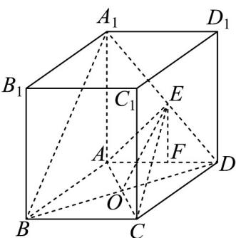

> [!faq]- 《专题21_立体几何初步及复数精选压轴60题12类考点专练_期中复习专项》官方解析
>
> > [!success]- **【答案】** (1)证明见解析 (2) $1; \frac{\sqrt{3}}{3}$
>
> > [!note]- **【分析】**
> > （1）由勾股定理证明 $AA_{1} \perp AB$ ， $AA_{1} \perp AD$ ，并根据线面垂直的判定定理证明 $AA_{1} \perp$ 平面 ABCD；
> >
> > (2) 连接 $BD$ 交 $AC$ 于点 $O$ , 则 $O$ 是 $BD$ 的中点. 由线面平行的性质定理可得 $EO$ 平行于 $A_{1}B$ , 因此点 $E$ 为
> >
> > $A_{1}D$ 的中点.根据线面垂直的判定定理可证.由 $AA_{1}\perp$ 平面 ABCD 求得三棱锥 $A_{1}-ACD$ 的体积，从而求得三
> >
> > 棱锥 E - ACD 的体积．
>
> > [!note]- **【解析】**
> > （1）∵底面ABCD是菱形， $\angle ABC=60^{\circ}$ ，
> >
> > $$
> > \therefore A B = A D = A C = 2
> > $$
> >
> > $$
> > \because A A _ {1} = 2 \qquad A _ {1} B = 2 \sqrt {2} \qquad_ {A B = 2} \therefore A A _ {1} ^ {2} + A B ^ {2} = A _ {1} B ^ {2}
> > $$
> >
> > $$
> > \therefore A A _ {1} \perp A B
> > $$
> >
> > 同理， $AA_{1} \perp AD$
> >
> > 又∵ $AB \subset$ 平面 ABCD ， $AD \subset$ 平面 ABCD ， $AB \cap AD = A$
> >
> > $\therefore AA_{1} \perp$ 平面 $ABCD$
> >
> > (2) 连接 BD 交 AC 于点 O，则 O 是 BD 的中点.
> >
> > 连接OE，则平面 $A_{1}BD \cap$ 平面 $EAC = OE$ 。
> >
> > 因为 $A_{1}B \parallel$ 平面 EAC ， $A_{1}B \subset$ 平面 $A_{1}BD$ ，所以 $OE \parallel A_{1}B$
> >
> > 所以点 E 为 $A_{1}D$ 的中点，所以 $\frac{A_{1}E}{ED}=1$
> >
> > 即当 $\frac{A_1E}{ED} = 1$ 时， $A_{1}B / /$ 平面 $EAC$ ：
> >
> > 证明：当 $\frac{A_1E}{ED} = 1$ 时，点 $E$ 为 $A_{1}D$ 的中点.
> >
> > 连接 BD 交 AC 于点 O，则 O 是 BD 的中点.
> >
> > 连接OE，则 $OE//A_{1}B$
> >
> > 又 $OE \subset$ 平面 EAC ， $A_{1}B \not\subset$ 平面 EAC ，
> >
> > 所以 $A_{1}B \parallel$ 平面 EAC.
> >
> > 又由（1）知 $AA_{1} \perp$ 平面 ABCD，
> >
> > 所以三棱锥 $A_{1} - ACD$ 的体积 $V_{A_1 - ACD} = \frac{1}{3} S_{\triangle ACD}\cdot AA_1 = \frac{1}{3}\times \frac{1}{2}\times 2\times 2\times \frac{\sqrt{3}}{2}\times 2 = \frac{2\sqrt{3}}{3}$
> >
> > 所以三棱锥 E-ACD 的体积 $V_{E-ACD}=\frac{1}{2}V_{A_{1}-ACD}=\frac{\sqrt{3}}{3}$
> >
> > 
> >
> > ## 2 考题猜想·高分必刷
