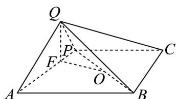
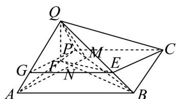

> [!faq]- 《专题21_立体几何初步及复数精选压轴60题12类考点专练_期中复习专项》官方解析
>
> > [!success]- **【答案】** ABD
>
> > [!note]- **【分析】**
> > 过点 $Q$ 作 $QF \perp AP$ ，求出 $QF$ 再利用体积公式计算可判断 A；记 $\triangle BCP$ 外接圆的圆心为 $BP$ 的中点 $O$ ，利用余弦定理计算三棱锥 $Q - BCP$ 外接球的半径 $\sqrt{OF^2 + \left(\frac{QF}{2}\right)^2}$ 判断 B；过点 $A$ 作 $AM \perp BP$ ，并与 $BF$ 交于点 $N$ ，求证 $QN \perp$ 平面 $ABCP$ ，进而求证 $BP \perp AQ$ 判断 C；在 $AQ$ 上取靠近点 $A$ 处的四等分点
> >
> > G $PG$ ，利用勾股定理计算 判断 D.
>
> > [!note]- **【解析】**
> > 当平面 $QAP \perp$ 平面ABCP时，四棱锥Q-ABCP的体积取得最大值.
> >
> > 过点 $Q$ 作 $QF \perp AP$ ，垂足为 $F$ ，则 $QF = \frac{AQ \cdot PQ}{AP} = \frac{2\sqrt{5}}{5}$
> >
> > 则四棱锥 $Q - ABCP$ 体积的最大值为 $\frac{1}{3} \times \frac{1}{2} \times (3 + 4) \times 2 \times \frac{2\sqrt{5}}{5} = \frac{14\sqrt{5}}{15}$ ，A正确；
> >
> > 连接 $BP$ ，记 $\triangle BCP$ 外接圆的圆心为 $BP$ 的中点 $O$ ，连接 $OF$ ，
> >
> > 因为 $AP = \sqrt{1^{2} + 2^{2}} = \sqrt{5}, BP = \sqrt{3^{2} + 2^{2}} = \sqrt{13}, AB = 4$
> >
> > 所以 $\cos\angle OPF=\frac{AP^{2}+PB^{2}-AB^{2}}{2AP\cdot PB}=\frac{5+13-16}{2\times\sqrt{5}\times\sqrt{13}}=\frac{\sqrt{65}}{65}$
> >
> > 因为 $PO = \frac{PB}{2} = \frac{\sqrt{13}}{2}$ ， $PF = \frac{QP^2}{AP} = \frac{1}{\sqrt{5}} = \frac{\sqrt{5}}{5}$
> >
> > $$
> > O F ^ {2} = P F ^ {2} + P O ^ {2} - 2 P F \cdot P O \cos \angle O P F = \frac {1}{5} + \frac {1 3}{4} - 2 \times \frac {\sqrt {5}}{5} \times \frac {\sqrt {1 3}}{2} \times \frac {\sqrt {6 5}}{6 5} = \frac {1 3}{4}
> > $$
> >
> > 则 $OF = \frac{\sqrt{13}}{2}$
> >
> > 则三棱锥 $Q - BCP$ 外接球的半径为 $\sqrt{OF^2 + \left(\frac{QF}{2}\right)^2} = \sqrt{\frac{69}{20}}$
> >
> > 则三棱锥 $Q - BCP$ 的外接球的表面积为 $4\pi \times \frac{69}{20} = \frac{69\pi}{5}$ ，B正确；
> >
> > 
> >
> > 连接 $BF$ ，因为 $BF^{2} = FP^{2} + BP^{2} - 2FP\cdot BP\cos \angle FPB = \frac{1}{5} +13 - 2\times \frac{\sqrt{5}}{5}\times \sqrt{13}\times \frac{\sqrt{65}}{65} = \frac{64}{5}$
> >
> > 所以 $BF^{2} + FP^{2} = BP^{2}$ ，则 $BF \perp AP$ ，
> >
> > 因为 $BF, QF \subset$ 平面 BFQ ， $QF \perp AP$ ，所以 $AP \perp$ 平面 BFQ ，
> >
> > 又 $AP \subset$ 平面 ABCP ，所以平面 ABCP ⊥ 平面 BFQ ，
> >
> > 则点 Q 在平面 ABCP 上的射影在直线 BF 上，
> >
> > 过点 A 作 $AM \perp BP$ ，并与 BF 交于点 N，连接 QM，
> >
> > 若点 $Q$ 在平面 $ABCP$ 上的射影为 $N$ ，即 $QN \perp$ 平面 $ABCP$ ，
> >
> > 由 $BP \subset$ 平面 $ABCP$ ，得 $QN \perp BP$ ，
> >
> > 又 $AM \perp BP$ ， $AM, QN \subset$ 平面 QAM，则 $BP \perp$ 平面 QAM，
> >
> > 因为 $AQ \subset$ 平面 QAM ，所以 $BP \perp AQ$ ，故 C 错误；
> >
> > 在 AQ 上取靠近点 A 处的四等分点 G ，连接 EG, PG ，
> >
> > 因为 $\overset{\square\square}{BE}=\frac{1}{4}\overset{\square\square}{BQ}$ ，所以 $EG//AB//PC$ ，且 $EG=\frac{3}{4}AB=CP$ ，
> >
> > 从而四边形 $ECPG$ 为平行四边形，则 $CE = PG = \sqrt{PQ^2 + QG^2} = \frac{\sqrt{13}}{2}$ ，D正确。
> >
> > 
