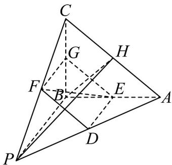
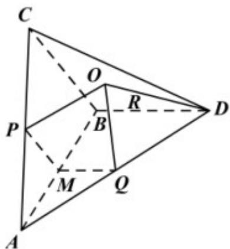
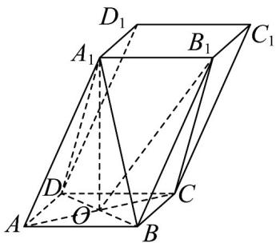

> [!faq]- 《专题21_立体几何初步及复数精选压轴60题12类考点专练_期中复习专项》官方解析
>
> > [!success]- **【答案】** AD
>
> > [!note]- **【分析】**
> > 对于A，根据线面平行的判定即可判断；对于B，取BC的中点G，则截面为四边形DEGF，四边形DEGF面积不为定值；对于C，设点P在平面ABC上的射影为H，可证PH⊥平面ABC，再由线面垂直的性质即可判断；对于D，易知球心O在线段PH上，再设PO=r，利用勾股定理求出r，再得到表
> >
> > 面积即可.
>
> > [!note]- **【解析】**
> > 对于 A，因为 DE 是 $\triangle PAB$ 的中位线，
> >
> > 所以 $DE \parallel PB$ 且 $DE = \frac{1}{2} PB$
> >
> > 因为 $DE \not\subset$ 平面 PBC， $PB \subset$ 平面 PBC，所以 $DE \parallel$ 平面 PBC，A 正确；
> >
> > 对于 B，取 BC 的中点 G，连接 GE，GF，
> >
> > 
> >
> > 则四边形 DEGF 为平行四边形，
> >
> > 过 D，E，F 的平面截三棱锥 P-ABC 所得的截面为 DEGF， $FG=\frac{5}{2}$ ，GE=3，
> >
> > 截面积 $S_{DEGF} = \frac{15}{2} \sin \angle FGE$ ,
> >
> > 但 $\angle FGE$ 的大小会随着点 $B$ 的运动而改变，所以所求截面的面积不是定值，B错误；
> >
> > 对于 C，设点 P 在平面 ABC 上的射影为 H，连接 HB，
> >
> > 因为 PA = PB = PC ，所以 HA = HB = HC
> >
> > 又 VABC 是直角三角形，所以 H 为线段 AC 的中点，
> >
> > 即 $PH \perp$ 平面 ABC ，若 $PB \perp AC$ ，则 $AC \perp BH$ ，
> >
> > 从而 $BA = BC$ ，显然题设中没有这个条件，C错误；
> >
> > 对于 D，显然球心 O 在线段 PH 上，
> >
> > 因为 PA = PC = 5 ， PH ⊥ AC ， AH = 3 ，所以 PH = 4 ，
> >
> > 设 $PO = r$ ，则 $OH = 4 - r$ ，由 $\left(4 - r\right)^2 +3^2 = r^2$
> >
> > 得 $r=\frac{25}{8}$ ，从而 $S_{球}=4\pi\times\frac{625}{64}=\frac{625}{16}\pi$ ，D正确。
> >
> > 5．三棱锥 A-BCD 满足 CA-CB=DA-DB=2，AB=4， $CD=3\sqrt{3}$ ， $CD\perp AB$ ，二面角 C-AB-D 的
> >
> > 大小为 $\frac{2\pi}{3}$ . 若三棱锥 $A - BCD$ 的所有顶点都在一个球面上, 则这个球体的表面积为
> >
> > 【答案】 $52\pi$
> >
> > 【分析】设 $A(-2,0,0)$ , $B(2,0,0)$ 利用双曲线的定义确定点 C、D 的轨迹，作 AB 的中垂线，结合二面角的
> >
> > 平面角，建立空间直角坐标系，将点的坐标表示出来，设球心坐标，利用球心到各顶点距离相等列方程，
> >
> > 求出球的半径，再用球的表面积公式计算结果.
> >
> > 【详解】在平面 ABC 内，∵ CA - CB = 2, AB = 4，以 AB 中点 M 为原点，MB 为 x 轴正向，
> >
> > 过 M 且垂直于 AB 的直线为 y 轴建立直角坐标系，
> >
> > 容易得到:点 C 在双曲线 $x^{2}-\frac{y^{2}}{3}=1, x$ 上，
> >
> > 同理，在平面ABD内，以AB中点M为原点，MB为x轴正向，过M且垂直于AB的直线为z轴建立直角
> >
> > 坐标系，容易得到，点 $D$ 在双曲线 $x^{2} - \frac{z^{2}}{3} = 1, x \quad 1$ 上，
> >
> > 由 $CD \perp AB$ ，所以 C、D 两点在直线 AB 上的投影相同，记为 H，
> >
> > ∴设 $MH = x_{0}, CH = DH = y_{0}$ ，则因为 $CH \perp AB, DH \perp AB$ ，
> >
> > 所以 $\angle CHD$ 为平面 $C - AB - D$ 的平面角, 所以 VCHD 中, $\angle CHD = \frac{2\pi}{3}$
> >
> > 由余弦定理， $CD^{2}=y_{0}^{2}+y_{0}^{2}-2y_{0}^{2}\cos\frac{2\pi}{3}$ ，解得：CH=DH=3，所以 $MH=x_{0}=2$
> >
> > 又 $MB = 2$ ，所以 $H, B$ 重合，则 $CB \perp AB, DB \perp AB$
> >
> > 所以 $Rt\triangle ABC, Rt\triangle ABD$ 的外接圆圆心分别为 AC, AD 的中点，分别记为 P, Q，
> >
> > 记 O 为外接球球心，则 $OP \perp$ 平面 ABC, $OQ \perp$ 平面 ABD，
> >
> > 则 O, P, M, Q 四点共面，且四边形 OQMP 中， $\angle OPM = \angle OQM = \frac{\pi}{2}, \angle PMQ = \frac{2\pi}{3}$
> >
> > 因为 $MP = \frac{1}{2} BC = \frac{3}{2}$ ，所以 $OP = OQ = PM\cdot \tan \frac{\pi}{3} = \frac{3\sqrt{3}}{2}$
> >
> > $$
> > Q D = \frac {1}{2} A D = \frac {1}{2} \sqrt {A B ^ {2} + B D ^ {2}} = \frac {5}{2}
> > $$
> >
> > 在 $Rt\triangle QQD$ 中， $OD = R = \sqrt{OQ^2 + QD^2} = \sqrt{\left(\frac{3\sqrt{3}}{2}\right)^2 + \left(\frac{5}{2}\right)^2} = \sqrt{13}$ .
> >
> > ∴三棱锥 A-BCD 的外接球的表面积为 $4\pi R^{2}=52\pi$ .
> >
> > 
> >
> > 6．平行六面体 $ABCD-A_{1}B_{1}C_{1}D_{1}$ 所有棱长都等于 2，点 $A_{1}$ 在底面 ABCD 的射影为底面对角线的交点，且线
> >
> > 段 $AA_{1}$ 是它在底面射影长的 $\sqrt{2}$ 倍，则三棱锥 $A - A_{1}BD$ 的外接球的体积为
> >
> > 【答案】 $\frac{8\sqrt{2}\pi}{3}$
> >
> > 【分析】根据外接球性质，结合平行六面体的性质确定球心及半径，最后利用球体积公式进行求解即可.
> >
> > 【详解】设底面对角线的交点为 $O$
> >
> > 
> >
> > 因为线段 $AA_{1}$ 是它在底面射影长的 $\sqrt{2}$ 倍，
> >
> > 所以 $AO = \sqrt{2}$ ，所以 $A_{1}O = \sqrt{AA_{1}^{2} - AO^{2}} = \sqrt{4 - 2} = \sqrt{2}$
> >
> > ∵ AB = AD ∴ AO ⊥ BD
> >
> > 即 $OB = \sqrt{AB^2 - AO^2} = \sqrt{2}$
> >
> > $\therefore BD = 2OB = 2\sqrt{2}$ ，则 $AB^{2} + AD^{2} = BD^{2}$
> >
> > 又 $A_{1}O \perp$ 平面 ABCD ， $BD \subset$ 平面 ABCD ，
> >
> > $\therefore A_{1}O \perp BD$ 则 $A_{1}B = A_{1}D = \sqrt{A_{1}O^{2} + OB^{2}} = 2$
> >
> > $\therefore A_{1}B^{2} + A_{1}D^{2} = BD^{2}$ ，即 $A_{1}B\perp A_{1}D$
> >
> > 三棱锥 $A-A_{1}BD$ 中， $\triangle ABD, \triangle A_{1}BD$ 均为直角三角形，
> >
> > 且平面 $ABD \cap$ 平面 $A_{1}BD = BD$
> >
> > 三棱锥 $A-A_{1}BD$ 的外接球是以 BD 为直径，O 为球心，半径 $R=\sqrt{2}$
> >
> > 外接球的体积为 $\frac{4\pi}{3}\cdot\left(\sqrt{2}\right)^{3}=\frac{8\sqrt{2}\pi}{3}$
