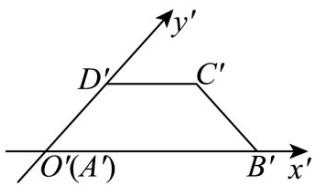
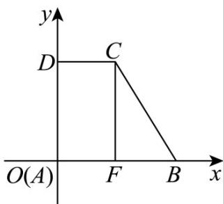
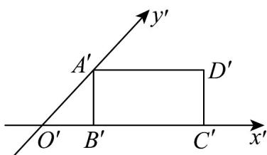
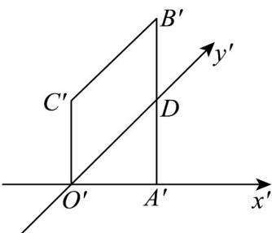
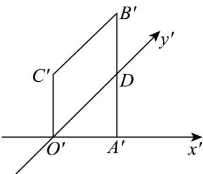

<!-- source-part:1 pages:1-50 -->

# 专题 21 立体几何初步及复数精选压轴 60 题 12 类考点专练   (期中复习专项训练)

## 真题实战·百练通关

<table><tr><td>选填小压轴</td><td>解答压轴</td></tr><tr><td>题型1 斜二测画法当中有关量的计算</td><td>题型8 复数的运算及几何意义大题</td></tr><tr><td>题型2 棱柱、棱锥、棱台的表面积和体积</td><td>题型9 空间中线共点及点共线问题</td></tr><tr><td>题型3 圆柱、圆锥、圆台的表面积和体积</td><td>题型10 空间点,直线平面之间的位置关系</td></tr><tr><td>题型4 球体的表面积和体积</td><td>题型11 空间直线与平面所成角及距离问题</td></tr><tr><td>题型5 几何图形有关截面问题</td><td>题型12 立体几何的综合性问题</td></tr><tr><td>题型6 异面直线所成的角的求算问题</td><td></td></tr><tr><td>题型7 复数的综合性考察</td><td></td></tr></table>

题型一 斜二测画法当中有关量的计算（共5小题）

1．如图，四边形ABCD的斜二测画法的直观图为等腰梯形 $A^{\prime}B^{\prime}C^{\prime}D^{\prime}$ ，已知 $A^{\prime}B^{\prime}=4$ ， $C^{\prime}D^{\prime}=2$ ，则下列说

法正确的是（ ）

A. $A^{\prime}D^{\prime} = 2\sqrt{2}$

B. $AB = 2$

C．四边形ABCD的面积为 $3\sqrt{2}$

D．四边形 ABCD 的周长为 $6 + 2\sqrt{3} + 2\sqrt{2}$

【答案】D

【分析】根据斜二测画法，画出原图，结合长度、面积、周长等知识进行分析，从而确定正确答案.
【详解】对于 A、B，由题设易得 $A'D' = \sqrt{2}$ ，原平面图如下 $AB = A'B' = 4$ ， $CD = C'D' = 2$ ， $AD = 2A'D' = 2\sqrt{2}$ ，故 A、B 错误；

对于 C，四边形 ABCD 的面积为： $\frac{1}{2}\times(4+2)\times2\sqrt{2}=6\sqrt{2}$ ，即 C 错误。

对于 D，在原图形中，过 C 作 $CF \perp AB$ 交 AB 于点 F，则 AF = DC = BF = 2，

由勾股定理得 $CB = \sqrt{2^2 + (2\sqrt{2})^2} = 2\sqrt{3}$

故四边形 $ABCD$ 的周长为： $4 + 2 + 2\sqrt{2} + 2\sqrt{3} = 6 + 2\sqrt{2} + 2\sqrt{3}$ ，即 D 正确；

2．如图，矩形 $A^{\prime}B^{\prime}C^{\prime}D^{\prime}$ 是水平放置的平面四边形 ABCD 用斜二测画法画出的直观图，其中 $A^{\prime}B^{\prime}=2$ ， $B^{\prime}C^{\prime}=4$ ，则原四边形ABCD中最长边的长度为（）

【答案】

A.2 B. $2\sqrt{2}$ C.4 D.6

【答案】D

【详解】将直观图还原为原图，如图，

在直观图中， $O'B' = A'B' = 2$ ，则 $O'A' = 2\sqrt{2}$

故在原图中， $OA = 2O'A' = 4\sqrt{2}$ ， $OB = O'B' = 2$

所以 $AB = \sqrt{OA^2 + OB^2} = \sqrt{32 + 4} = 6$ ，而 $AD = BC = B'C' = 4$

所以原四边形 ABCD 中最长边为 6.

3．如图，四边形ABCD的斜二测画法的直观图为等腰梯形 $A^{\prime}B^{\prime}C^{\prime}D^{\prime}$ ，已知 $A^{\prime}B^{\prime} = 4$ ， $C^{\prime}D^{\prime} = 2$ ，则下列说

法正确的是（）

A. $A^{\prime}D^{\prime} = 2\sqrt{2}$ B. $AB = 4$

C．四边形ABCD的面积为 $6\sqrt{2}$ D．四边形ABCD的周长为 $6+\sqrt{6}+\sqrt{2}$

【答案】BC

【分析】A选项，作出辅助线，得到各边长，结合 $\angle DAM = 45^{\circ}$ ，求出 $A^{\prime}D^{\prime} = \sqrt{2}$ ；B选项，由斜二测法

可知 $AB = A'B' = 4$ ；C选项，作出原图形，求出各边，由梯形面积公式得到C正确；D选项，在C基础上，

求出各边长，得到周长。

【详解】对于 A 选项，过点 $C'$ ， $D'$ 作 $C'N$ ， $D'M$ 垂直于 $x'$ 轴于点 N，M

因为等腰梯形 $A^{\prime}B^{\prime}C^{\prime}D^{\prime}$ 中 $A^{\prime}B^{\prime}=4$ ， $C^{\prime}D^{\prime}=2$ ，

所以 $MN = 2$ ， $A^{\prime}M = B^{\prime}N = 1$

又 $\angle D^{\prime}A^{\prime}M = 45^{\circ}$ ，所以 $A^{\prime}D^{\prime} = \sqrt{2}$ ，故A错误；

对于 B 选项，由斜二测法可知 $AB = A'B' = 4$ ，故 B 正确；

对于 C 选项，作出原图形，可知 $AD = 2A'D' = 2\sqrt{2}$ ， $AB = 4$ ， $CD = 2$ ， $AD \perp AB$ ，

故四边形 ABCD 的面积为 $\frac{(CD+AB)\cdot AD}{2}=6\sqrt{2}$ ，故 C 正确；

对于 D 选项，过点 C 作 $CH \perp AB$ 于点 H ，

则 $AH = CD = 2$ ， $BH = 4 - 2 = 2$ ， $CH = AD = 2\sqrt{2}$

由勾股定理得 $BC = \sqrt{BH^2 + CH^2} = 2\sqrt{3}$

四边形 $ABCD$ 的周长为 $AB + CD + AD + BC = 4 + 2 + 2\sqrt{2} + 2\sqrt{3} = 6 + 2\sqrt{2} + 2\sqrt{3}$ ，故D错误.

4．一水平放置的平面四边形 OABC 的直观图 $O'A'B'C'$ 如图所示，其中 $O'A'=O'C'=2$ ， $O'C'\perp x'$ 轴， $A^{\prime}B^{\prime}\perp x^{\prime}$ 轴， $B^{\prime}C^{\prime}//y^{\prime}$ 轴，则四边形 OABC 的面积为（）

【答案】

A. $\frac{3\sqrt{2}}{2}$ B.6 C. $\frac{3}{2}$ D. $12\sqrt{2}$

【答案】D

【分析】结合图形可得 $A'B' = 4$ ，求出四边形 $O'A'B'C'$ 面积后可得四边形 OABC 的面积。
【详解】设 $y'$ 轴与 $A'B'$ 交点为 D，
因为 $O'C' \perp x'$ 轴， $A'B' \perp x'$ 轴，
所以 $O'C' // A'B'$

因为 $B^{\prime}C^{\prime}//y^{\prime}$ 轴，

所以四边形 $B^{\prime}C^{\prime}O^{\prime}D$ 为平行四边形，

故 $DB' = O'C' = 2$

又 $\angle x^{\prime}O^{\prime}y^{\prime} = 45^{\circ}$ ， $A^{\prime}B^{\prime}\perp x^{\prime}$ 轴，

得 $DA' = O'A' = 2$ ，

故 $A^{\prime}B^{\prime}=4$

所以四边形 $O^{\prime}A^{\prime}B^{\prime}C^{\prime}$ 面积为 $\frac{1}{2}(2+4)\times2=6$ ,

因为四边形 $O'A'B'C'$ 面积是四边形 $OABC$ 的面积的 $\frac{\sqrt{2}}{4}$

所以四边形 $OABC$ 的面积为 $12 \sqrt{2}$

5. 如图是利用斜二测画法画出的 Rt△ABO 的直观图，已知 $A^{\prime}B^{\prime}//O^{\prime}y^{\prime}, O^{\prime}B^{\prime}=4,\triangle ABO$ 的面积为 16，过点 $A'$ 作 $A'C'\perp x'$ 轴于点 $C'$ ，则 $A'C'$ 的长为（）

【答案】

A. $16\sqrt{2}$ B. $\sqrt{2}$ C. $2\sqrt{2}$ D. 1

【答案】C

【详解】因为 $A^{\prime}B^{\prime}//O^{\prime}y^{\prime}$ ， $O^{\prime}B^{\prime}=4$ 所以原 Rt△ABO 中， $AB\perp OB$ ，且 x 轴方向长度不变，

因此 $OB = O'B' = 4$

已知 Rt△ABO 面积为 16，由直角三角形面积公式： $\frac{1}{2}OB\cdot AB=16\Rightarrow\frac{1}{2}\times4\cdot AB=16\Rightarrow AB=8$ 在斜二测画法中，y轴方向长度变为原来的 $\frac{1}{2}$ ，因此 $A^{\prime}B^{\prime}=\frac{1}{2}AB=\frac{1}{2}\times8=4$

因为 $y'$ 轴与 $x'$ 轴夹角为 $45^{\circ}$ ， $A'C'\perp x'$ 轴，

所以在直角三角形 $\mathrm{Rt}\triangle A'B'C'$ 中： $A^{\prime}C^{\prime} = A^{\prime}B^{\prime}\sin 45^{\circ} = 4\times \frac{\sqrt{2}}{2} = 2\sqrt{2}$

因此 $A^{\prime}C^{\prime}$ 的长为 $2\sqrt{2}$ .

![[高中/课堂同步/题库/人教A版高中数学同步讲义(2026)/02_必修第二册/期中专项训练+期中模拟卷/专项训练/专题21_立体几何初步及复数精选压轴60题12类考点专练_期中复习专项/题型二_棱柱_棱锥_棱台的表面积和体积_共5小题_sec_01/题型二_棱柱_棱锥_棱台的表面积和体积_共5小题_sec_01.md]]
![[高中/课堂同步/题库/人教A版高中数学同步讲义(2026)/02_必修第二册/期中专项训练+期中模拟卷/专项训练/专题21_立体几何初步及复数精选压轴60题12类考点专练_期中复习专项/题型五_几何图形有关截面问题_共5小题_sec_02/题型五_几何图形有关截面问题_共5小题_sec_02.md]]
![[高中/课堂同步/题库/人教A版高中数学同步讲义(2026)/02_必修第二册/期中专项训练+期中模拟卷/专项训练/专题21_立体几何初步及复数精选压轴60题12类考点专练_期中复习专项/题型七_复数的综合性考察_共5小题_sec_03/题型七_复数的综合性考察_共5小题_sec_03.md]]
