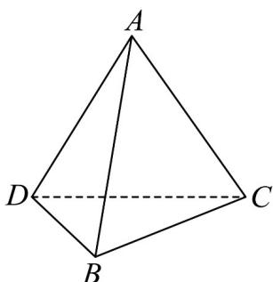
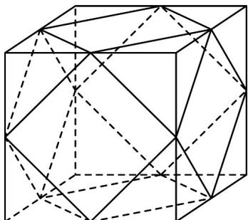

## 题型二 棱柱、棱锥、棱台的表面积和体积（共5小题）

6．四面体 ABCD 中，直线 AC 与 BD 所成的角为 $\frac{\pi}{3}$ ，BD = 2，AC = 3， $\angle BCD = \frac{2\pi}{3}$ ，则四面体 ABCD 的体积的最大值为 \_\_\_\_。

【答案】 $\frac{1}{2}/0.5$

【分析】在 $\triangle BCD$ 中，由余弦定理结合基本不等式求出 $\triangle BCD$ 面积的最大值；结合线线角可得点 $A$ 到平

面 BCD 距离的最大值，即可计算求解.

【详解】

设点 A 到平面 BCD 距离为 d，BC = x，CD = y

$$
\because B D ^ {2} = x ^ {2} + y ^ {2} - 2 x y \cos \angle B C D = x ^ {2} + y ^ {2} + x y = 4
$$

$\therefore 4 = x^{2} + y^{2} + xy \quad 2xy + xy = 3xy$ ，即 $xy \leq \frac{4}{3}$ （当且仅当 $x = y = \frac{2\sqrt{3}}{3}$ 时取等号），

$\therefore S_{\triangle BCD} \leq \frac{1}{2} xy \sin \angle BCD = \frac{1}{2} \times \frac{4}{3} \times \frac{\sqrt{3}}{2} = \frac{\sqrt{3}}{3}$ （当且仅当 $x = y = \frac{2\sqrt{3}}{3}$ 时取等号）；

∵ 直线 AC 与 BD 所成角为 $\frac{\pi}{3}$ ，∴ 直线 AC 与平面 BCD 所成角的最大值为 $\frac{\pi}{3}$

∴点 A 到平面 BCD 距离的最大值 $d_{\max} = AC \sin \frac{\pi}{3} = \frac{3\sqrt{3}}{2}$

∴ 四面体 ABCD 体积的最大值为 $\frac{1}{3} \times \frac{\sqrt{3}}{3} \times \frac{3\sqrt{3}}{2} = \frac{1}{2}$ .

7. 水晶是一种石英结晶体矿物，因其硬度、色泽、光学性质、稀缺性等，常被人们制作成饰品。如图所

示，现有棱长为 $2\mathrm{cm}$ 的正方体水晶一块，将其裁去八个相同的四面体，打磨成饰品，则该饰品的表面积

为（）

A. $\left(16 + 3\sqrt{3}\right)\mathrm{cm}^2$

B. $\left(16 + 4\sqrt{3}\right)\mathrm{cm}^2$

C. $\left(12 + 3\sqrt{3}\right)\mathrm{cm}^2$

D. $\left(12 + 4\sqrt{3}\right)\mathrm{cm}^2$

【答案】D

【详解】原正方体棱长为 $2\mathrm{cm}$ ，裁去八个相同的四面体时，切割点应该为正方体各棱的中点，每个面切掉四个角后，剩余一个边长为 $\sqrt{2}\mathrm{cm}$ 的小正方形，

则六个小正方形面的面积和为 $6 \times \sqrt{2}^{2} = 12\mathrm{cm}^{2}$ ：

而切掉正方体的8个顶点后，每个切口新增一个边长为 $\sqrt{2}\mathrm{cm}$ 的正三角形，

则八个正三角形面的面积和为 $\frac{1}{2} \times \sqrt{2} \times \sqrt{2} \times \frac{\sqrt{3}}{2} \times 8 = 4\sqrt{3}\mathrm{cm}^2$

所以该饰品的表面积为 $\left(12+4\sqrt{3}\right)\mathrm{cm}^{2}$

![[高中/课堂同步/题库/人教A版高中数学同步讲义(2026)/02_必修第二册/期中专项训练+期中模拟卷/专项训练/专题21_立体几何初步及复数精选压轴60题12类考点专练_期中复习专项/_compact/Q00064302.md]]
![[高中/课堂同步/题库/人教A版高中数学同步讲义(2026)/02_必修第二册/期中专项训练+期中模拟卷/专项训练/专题21_立体几何初步及复数精选压轴60题12类考点专练_期中复习专项/_compact/Q00064303.md]]
![[高中/课堂同步/题库/人教A版高中数学同步讲义(2026)/02_必修第二册/期中专项训练+期中模拟卷/专项训练/专题21_立体几何初步及复数精选压轴60题12类考点专练_期中复习专项/_compact/Q00064304.md]]
![[高中/课堂同步/题库/人教A版高中数学同步讲义(2026)/02_必修第二册/期中专项训练+期中模拟卷/专项训练/专题21_立体几何初步及复数精选压轴60题12类考点专练_期中复习专项/_compact/Q00064305.md]]
![[高中/课堂同步/题库/人教A版高中数学同步讲义(2026)/02_必修第二册/期中专项训练+期中模拟卷/专项训练/专题21_立体几何初步及复数精选压轴60题12类考点专练_期中复习专项/_compact/Q00064306.md]]
![[高中/课堂同步/题库/人教A版高中数学同步讲义(2026)/02_必修第二册/期中专项训练+期中模拟卷/专项训练/专题21_立体几何初步及复数精选压轴60题12类考点专练_期中复习专项/_compact/Q00064307.md]]
![[高中/课堂同步/题库/人教A版高中数学同步讲义(2026)/02_必修第二册/期中专项训练+期中模拟卷/专项训练/专题21_立体几何初步及复数精选压轴60题12类考点专练_期中复习专项/_compact/Q00064308.md]]
![[高中/课堂同步/题库/人教A版高中数学同步讲义(2026)/02_必修第二册/期中专项训练+期中模拟卷/专项训练/专题21_立体几何初步及复数精选压轴60题12类考点专练_期中复习专项/_compact/Q00064309.md]]
![[高中/课堂同步/题库/人教A版高中数学同步讲义(2026)/02_必修第二册/期中专项训练+期中模拟卷/专项训练/专题21_立体几何初步及复数精选压轴60题12类考点专练_期中复习专项/_compact/Q00064310.md]]
![[高中/课堂同步/题库/人教A版高中数学同步讲义(2026)/02_必修第二册/期中专项训练+期中模拟卷/专项训练/专题21_立体几何初步及复数精选压轴60题12类考点专练_期中复习专项/_compact/Q00064311.md]]
