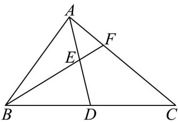

<!-- question-source:start -->
35．如图，在△ABC中，AB=4,AC=6,BC=8．取BC边中点D，连接AD，设E为AD中点，连接BE

并延长与 $\triangle ABC$ 交于点 $F$ ，则 $EF$ 的长为 \_\_\_\_.

<!-- question-source:end -->

![[高中/课堂同步/题库/人教A版高中数学同步讲义(2026)/02_必修第二册/期中专项训练+期中模拟卷/专项训练/专题22_解三角形精选压轴60题12类考点专练_高效培优期中专项训练_/_compact/answers/Q00064383A1.md]]
