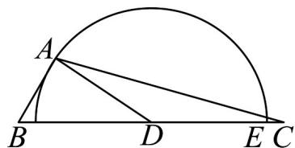

<!-- question-source:start -->
1. 某种健身拉力器的手臂固定支架为 $BE$ ，需运动者将肩关节放置于点 $B$ 处，手肘放置于点 $D$ 处，手掌

放置于点 $E$ 处握拳握住弹力绳的一端，弹力绳的另一端连接于点 $C$ 处；保持 $B$ 、 $D$ 、 $E$ 、 $C$ 四点共线．将

小臂视为线段 $DE$ ，长度为 $r$ ，大臂视为线段 $BD$ ，长度为 $1.3r$ 。在锻炼时要求保持肩关节 $B$ 和手肘 $D$ 不动。

运用大臂力量将小臂 $DE$ 绕着手肘 $D$ 作圆周运动，始终与 $BC$ 处于同一平面，弹力绳随之以紧绷状态从

CE 拉伸至 CA．已知某位运动者健身时 CE = 0.1r，当弹力绳拉至最长时， $\angle ABC = 3\angle ACB$ ，则此时

∠ ACB =

\_\_\_\_度．（结果精确到0.1度）

<!-- question-source:end -->

![[高中/课堂同步/题库/人教A版高中数学同步讲义(2026)/02_必修第二册/期中专项训练+期中模拟卷/专项训练/专题22_解三角形精选压轴60题12类考点专练_高效培优期中专项训练_/_compact/answers/Q00064409A1.md]]
