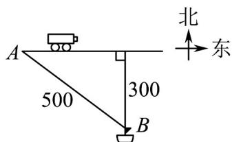

<!-- question-source:start -->
5. 如图，一辆汽车从 $A$ 市出发沿海岸一条笔直公路以 $100\mathrm{km / h}$ 的速度向东匀速行驶，汽车开动时，在 $A$

市南偏东方向距 $A$ 市 $500\mathrm{km}$ 且与海岸距离为 $300\mathrm{km}$ 的海上 $B$ 处有一艘快艇与汽车同时出发，要把一份文

件交给这辆汽车的司机。

(1)若快艇每小时最快行驶 $75\mathrm{km}$ ，快艇应如何行驶才能尽快把文件交到司机手中？最快需多长时间？

(2)快艇至少以多大的速度行驶才能把文件送到司机手中？
<!-- question-source:end -->

![[高中/课堂同步/题库/人教A版高中数学同步讲义(2026)/02_必修第二册/期中专项训练+期中模拟卷/专项训练/专题22_解三角形精选压轴60题12类考点专练_高效培优期中专项训练_/_compact/answers/Q00064413A1.md]]
