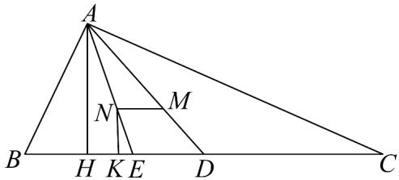

> [!faq]- 《专题22_解三角形精选压轴60题12类考点专练_高效培优期中专项训练_》官方解析
>
> > [!success]- **【答案】** 3
>
> > [!note]- **【分析】**
> > 将 $\frac{\sin C}{\cos C} = \frac{\sin A}{2 - \cos A}$ 变形得到 $2\sin C = \sin C\cos A + \sin A\cos C$ ，利用两角和的正弦公式得到
> >
> > $2\sin C = \sin (C + A)$ ，利用三角形内角和和诱导公式得到 $2\sin C = \sin B$ ，利用正弦定理得到 $2c = b$ ，从而
> >
> > 得到 $b$ 的值，利用 $S_{\triangle ABC} = \frac{1}{2} ah = \frac{1}{2}(a + 2 + 4)\cdot r$ 得到 $ah = (a + 6)\cdot r$ ，由 $M,N$ 是 $\vee ABC$ 的重心和内心和
> >
> > $MN / / BC$ 得到 $\frac{r}{h} = \frac{NE}{AE} = \frac{DM}{AD} = \frac{1}{3}$ ，从而得到 $h = 3r$ ，将其代入 $ah = (a + 6)\cdot r$ 得到 $a$ 的值
>
> > [!note]- **【解析】**
> > $\because \frac{\sin C}{\cos C} = \frac{\sin A}{2 - \cos A}$ ， $\therefore \sin C(2 - \cos A) = \sin A\cos C$
> >
> > $$
> > \therefore 2 \sin C = \sin C \cos A + \sin A \cos C = \sin (C + A)
> > $$
> >
> > $$
> > \therefore 2 \sin C = \sin (\pi - B) \text {, 即} 2 \sin C = \sin B
> > $$
> >
> > 由正弦定理，可得 $2c = b$ ， $\because c = 2$ ， $\therefore b = 4$
> >
> > 如图，延长 AM 交 BC 于点 D，延长 AN 交 BC 于点 E，
> >
> > 过点 A 作 $AH \perp BC$ 于点 H ，过点 N 作 $NK \perp BC$ 于点 K ，
> >
> > 设 $\vee ABC$ 的内切圆的半径为r，BC边上的高为h，
> >
> > $$
> > \because S _ {\triangle A B C} = \frac {1}{2} a h = \frac {1}{2} (a + 2 + 4) \cdot r, \therefore a h = (a + 6) \cdot r (*),
> > $$
> >
> > ∵ M, N $\forall ABC$ 是的重心和内心，且 MN // BC
> >
> > $$
> > \therefore \frac {r}{h} = \frac {N E}{A E} = \frac {D M}{A D} = \frac {1}{3}, \therefore h = 3 r,
> > $$
> >
> > 将其代入（\*），可得 $a \cdot 3r = (a + 6) \cdot r$
> >
> > 解得 $a = 3$
> >
> > 
