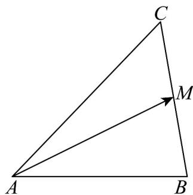

> [!faq]- 《专题22_解三角形精选压轴60题12类考点专练_高效培优期中专项训练_》官方解析
>
> > [!success]- **【答案】** A. $a = \sqrt{7}$ B. $C = \frac{\pi}{4}$ C. $\vee ABC$ 的外接圆面积为 $\frac{7\pi}{3}$ D. 若 $M$ 为 $BC$ 中点，则 $AM = \frac{19}{4}$
>
> > [!note]- **【分析】**
> > 由余弦定理判断 A, B；利用正弦定理求出 $\forall ABC$ 的外接圆的半径，即可判断 C；利用向量判断 D.
>
> > [!note]- **【解析】**
> > 对于 A，由余弦定理可得 $a^{2}=b^{2}+c^{2}-2bc\cos A=7$
> >
> > 所以 $a = \sqrt{7}$ ，故A正确；
> >
> > 对于B，由余弦定理可得 $\cos C = \frac{a^2 + b^2 - c^2}{2ab} = \frac{2\sqrt{7}}{7}$
> >
> > 所以 $C \neq \frac{\pi}{4}$ ，故B错误；
> >
> > 对于 C，由正弦定理可得 $2R = \frac{a}{\sin A} = \frac{2\sqrt{21}}{3}$
> >
> > 所以 $R=\frac{\sqrt{21}}{3}$ ，
> >
> > 所以 $\vee ABC$ 的外接圆面积为 $S = \pi R^2 = \frac{7\pi}{3}$ ，故C正确；
> >
> > 对于 D，因为 M 为 BC 中点，
> >
> > 
> >
> > 所以 $AM = \frac{1}{2}(AB + AC)$ ，
> >
> > 所以 $AM^{2}=\frac{1}{4}(AB+AC+2AB\cdot AC)=\frac{19}{4}$
> >
> > 所以 $AM = \frac{\sqrt{19}}{2}$ ，故 D 错误.
> >
> > 故选 **AC**.
