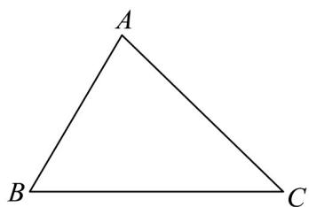

> [!faq]- 《专题22_解三角形精选压轴60题12类考点专练_高效培优期中专项训练_》官方解析
>
> > [!success]- **【答案】** (1)证明见解析； (2)证明见解析.
>
> > [!note]- **【分析】**
> > （1）利用平面向量余弦夹角公式得到证明；
> >
> > (2) $\overline{BC} = \overline{AC} - \overline{AB}$ 两边平方得 $\left|\overline{BC}\right|^{2} = \left|\overline{AC}\right|^{2} + \left|\overline{AB}\right|^{2} - 2\left|\overline{AC}\right|\left|\overline{AB}\right| \cos A$ ，从而得到 $a^{2} = b^{2} + c^{2} - 2bc \cos A$ .
>
> > [!note]- **【解析】**
> > （1）如图，
> >
> > 
> >
> > $\cos B = \frac{\square BA \cdot BC}{|BA| \cdot |BC|}, \cos C = \frac{\square GB \cdot CA}{|CB| \cdot |CA|}$
> >
> > $$
> > \therefore c \cos B + b \cos C = | A B | \cos B + | A C | \cdot \cos C
> > $$
> >
> > $$
> > = \frac {\square B A \cdot B C}{| B C |} + \frac {\square C B \cdot C A}{| C B |} = \frac {\square B A \cdot B C \rightarrow B C \cdot C A}{| B C |}
> > $$
> >
> > $$
> > = \frac {\stackrel {{\square \square \square}} {{B C}} (B A - C A)}{| B C |} = \frac {\stackrel {{\square \square \square}} {{B G}} ^ {2}}{| B C |} = | \stackrel {{\square \square \square}} {{B C}} | = a,
> > $$
> >
> > $$
> > \therefore a = b \cos C + c \cos B.
> > $$
> >
> > (2) 在 $\forall ABC$ 中， $\because BC = AC - AB$
> >
> > $$
> > \left| \overline {{B C}} \right| ^ {2} = (A C - A B) ^ {2} = \overline {{A C}} ^ {2} + \overline {{A B}} ^ {2} - 2 A C \cdot A B
> > $$
> >
> > $$
> > = \left| A C \right| ^ {2} + \left| A B \right| ^ {2} - 2 \left| A C \right| \left| A B \right| \cos A
> > $$
> >
> > ∵BC、CA、AB的长分别为a、b、c，
> >
> > $$
> > \therefore | \stackrel {{\sqcup \sqcup \sqcup}} {B C} | = a, | \stackrel {{\sqcup \sqcup \sqcup}} {A C} | = b, | \stackrel {{\sqcup \sqcup \sqcup}} {A B} | = c
> > $$
> >
> > $$
> > \therefore a ^ {2} = b ^ {2} + c ^ {2} - 2 b c \cos A.
> > $$
