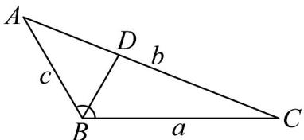

> [!faq]- 《专题22_解三角形精选压轴60题12类考点专练_高效培优期中专项训练_》官方解析
>
> > [!success]- **【答案】** (1) $B=\frac{2\pi}{3}$ (2) $BD = \frac{15}{8}$
>
> > [!note]- **【分析】**
> > （1）根据 $p \perp q$ 以及余弦定理即可得到答案；
> >
> > (2) 由题意得出 $c$ 的长度，再根据 $S_{\triangle ABC} = S_{\triangle ABD} + S_{\triangle CBD}$ ，利用面积公式求解即可.
>
> > [!note]- **【解析】**
> > （1）因为 $p \perp q$ ，所以 $p \cdot q = 0 \Rightarrow (a + b)(a - b) + c(a + c) = 0$ ，即 $a^2 + c^2 - b^2 = -ac$
> >
> > 由余弦定理得 $\cos B = \frac{a^{2} + c^{2} - b^{2}}{2ac} = -\frac{1}{2}$ ，因为 $B \in (0, \pi)$ ，所以 $B = \frac{2\pi}{3}$ .
> >
> > (2) 由 (1) 得 $a^2 + c^2 - b^2 = -ac$ ，又 $b = 7, a = 5$ ，代入解得 $c = 3$ 或 $c = -8$ （舍），
> >
> > 
> >
> > 如图所示： $S_{\triangle ABC}=\frac{1}{2}ac\sin B=S_{\triangle ABD}+S_{\triangle CBD}=\frac{1}{2}c\cdot BD\cdot\sin\frac{\pi}{3}+\frac{1}{2}a\cdot BD\cdot\sin\frac{\pi}{3}$
> >
> > 代入数据得 $\frac{1}{2} \times 5 \times 3 \times \sin \frac{2\pi}{3} = \frac{1}{2} \times 3 \times BD \times \sin \frac{\pi}{3} + \frac{1}{2} \times 5 \times BD \times \sin \frac{\pi}{3}$
> >
> > <!-- source-part:2 pages:51-97 -->
> >
> > 解得 $BD=\frac{15}{8}$ .
