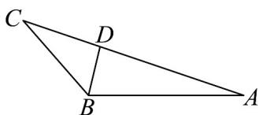

> [!faq]- 《专题22_解三角形精选压轴60题12类考点专练_高效培优期中专项训练_》官方解析
>
> > [!success]- **【答案】** (1) $\frac{2\pi}{3}$ (2) $\left(6,3+2\sqrt{3}\right]$ $$ 5 \sqrt {7} $$ (3) 14
>
> > [!note]- **【分析】**
> > （1）利用正弦定理结合三角变换公式化简题设条件可得 $\cos B = -\frac{1}{2}$ ，从而可求 $B$ ；
> >
> > (2) 利用正弦定理可得 $a + c = 2\sqrt{3} (\sin A + \sin C)$ ，再利用三角变换公式化简后可求 $a + c$ 的取值范围，从
> >
> > 而可得周长的取值范围；
> >
> > (3) 由角平分线的性质可得 $c = 2a$ ，两次利用余弦定理可求 $\cos A$ 的值.
>
> > [!note]- **【解析】**
> > （1）由 $\cos B(c\cos B + b\cos C) + \frac{1}{2}a = 0$ 和正弦定理，
> >
> > 可得 $\cos B\left(\sin C\cos B + \cos C\sin B\right) + \frac{1}{2}\sin A = 0$
> >
> > 因 $\sin C\cos B + \cos C\sin B = \sin(B + C) = \sin A$
> >
> > 代入可得 $\sin A(\cos B + \frac{1}{2}) = 0$
> >
> > 因 $0 < A < \pi$ ，则 $\sin A > 0$ ，故 $\cos B = -\frac{1}{2}$
> >
> > 又因 $0 < B < \pi$ ，故 $B = \frac{2\pi}{3}$ ；
> >
> > (2) 由正弦定理有 $\frac{a}{\sin A} = \frac{c}{\sin C} = \frac{b}{\sin B} = \frac{3}{\sin \frac{2\pi}{3}} = 2\sqrt{3}$
> >
> > 所以 $a = 2\sqrt{3}\sin A, c = 2\sqrt{3}\sin C$ ，而 $A + C = \frac{\pi}{3}$
> >
> > 所以 $a + c = 2\sqrt{3} \sin A + 2\sqrt{3} \sin C = 2\sqrt{3} \sin A + 2\sqrt{3} \sin \left( \frac{\pi}{3} - A \right)$
> >
> > $$
> > = 2 \sqrt {3} \sin A + 2 \sqrt {3} \times \frac {\sqrt {3}}{2} \cos A - 2 \sqrt {3} \times \frac {1}{2} \sin A = \sqrt {3} \sin A + 3 \cos A = 2 \sqrt {3} \cos \left(A - \frac {\pi}{6}\right)
> > $$
> >
> > 因为 $0 < A < \frac{\pi}{3}$ ，故 $-\frac{\pi}{6} < A - \frac{\pi}{6} < \frac{\pi}{6}$ ，故 $3 < 2\sqrt{3}\cos \left(A - \frac{\pi}{6}\right) \leq 2\sqrt{3}$
> >
> > 故 $6 < a + b + c \leq 3 + 2\sqrt{3}$ ，即周长的取值范围为 $\left(6,3 + 2\sqrt{3}\right]$
> >
> > (3)
> >
> > 
> >
> > 如图，因 BD 平分 $\angle ABC$ ，且 AD = 2DC，
> >
> > 由角平分线的性质可得 $\frac{AB}{BC} = \frac{AD}{DC} = 2$ ，即 $c = 2a$ ，
> >
> > 在VABC中，由余弦定理， $b^{2}=a^{2}+c^{2}-2ac\cos B$ ，
> >
> > 即得 $b^{2} = a^{2} + 4a^{2} + 2a^{2} = 7a^{2}$ ，则 $b = \sqrt{7} a$
> >
> > 故 $\cos A=\frac{b^{2}+c^{2}-a^{2}}{2bc}=\frac{7a^{2}+4a^{2}-a^{2}}{2\sqrt{7}a\cdot2a}=\frac{10a^{2}}{4\sqrt{7}a^{2}}=\frac{5\sqrt{7}}{14}$
