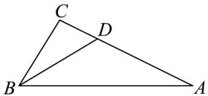

> [!faq]- 《专题22_解三角形精选压轴60题12类考点专练_高效培优期中专项训练_》官方解析
>
> > [!success]- **【答案】** (1) $(2,8)$ (2) 8
>
> > [!note]- **【分析】**
> > （1）根据正弦定理角化边可得到 $B = \frac{\pi}{3}$ ，再根据余弦定理的推论即可解出；
> >
> > （2）根据邻角互补可得 $\cos \angle ADB + \cos \angle CDB = 0$ ，即可由余弦定理化简得到 $\frac{2}{3} b^2 - 2a^2 - c^2 + 3 = 0$ ，再
> >
> > 结合题干中角化边得到的 $b^{2} = a^{2} + c^{2} - ac$ ，消去 $b^{2}$ 可得， $4a^{2} + c^{2} + 2ac = 9$ ，然后根据基本不等式求出 $ac$
> >
> > 的范围，即可得到VABC面积的最大值.
>
> > [!note]- **【解析】**
> > （1）由 $(a+b)(\sin A-\sin B)=c(\sin A-\sin C)$ ，
> >
> > 根据正弦定理可得， $(a+b)(a-b)=c(a-c)$
> >
> > 则 $a^2 - b^2 = ac - c^2$ ，即 $a^2 + c^2 - b^2 = ac$
> >
> > 所以 $\cos B = \frac{a^2 + c^2 - b^2}{2ac} = \frac{1}{2}$
> >
> > 又 $B \in (0, \pi)$ ，所以 $B = \frac{\pi}{3}$
> >
> > 因为 $\forall ABC$ 为锐角三角形，所以 $\cos A > 0, \cos C > 0$
> >
> > 则 $\left\{ \begin{array}{l} b^{2} + c^{2} > a^{2} \\ a^{2} + b^{2} > c^{2} \end{array} \right.$ ，又 $a^2 + c^2 - b^2 = ac$ ，即 $b^{2} = a^{2} + c^{2} - ac$ ，
> >
> > 则 $\left\{\begin{aligned}&2c^{2}-ac>0\\ &2a^{2}-ac>0\end{aligned}\right.$ ，又 c=4，解得 2<a<8，
> >
> > 即 a 的取值范围为 $(2,8)$ .
> >
> > (2) 在 $\triangle ABD$ 中， $AD = \frac{2}{3} b$ ， $BD = 1$ ，
> >
> > $$
> > \cos \angle A D B = \frac {A D ^ {2} + B D ^ {2} - A B ^ {2}}{2 A D \times B D} = \frac {\frac {4}{9} b ^ {2} + 1 - c ^ {2}}{\frac {4}{3} b},
> > $$
> >
> > 在 $\triangle BDC$ 中， $CD = \frac{1}{3} b$ ， $BD = 1$
> >
> > $$
> > \cos \angle C D B = \frac {C D ^ {2} + B D ^ {2} - B C ^ {2}}{2 B D \times C D} = \frac {\frac {1}{9} b ^ {2} + 1 - a ^ {2}}{\frac {2}{3} b},
> > $$
> >
> > $\because \angle ADB + \angle CDB = \pi$ ，所以 $\cos \angle ADB + \cos \angle CDB = 0$
> >
> > 所以 $\frac{\frac{4}{9}b^2 + 1 - c^2}{\frac{4}{3}b} + \frac{\frac{1}{9}b^2 + 1 - a^2}{\frac{2}{3}b} = 0$ ，即 $\frac{2}{3} b^2 - 2a^2 - c^2 + 3 = 0$ ，
> >
> > 由（1）知， $b^{2}=a^{2}+c^{2}-ac$ ，所以 $4a^{2}+c^{2}+2ac=9\quad4ac+2ac=6ac$ ，
> >
> > 即 $ac \leq \frac{3}{2}$ （当且仅当 $2a = c$ 时取等号），
> >
> > 则 $S_{\triangle ABC} = \frac{1}{2} ac\sin B = \frac{\sqrt{3}}{4} ac\leq \frac{3\sqrt{3}}{8}$
> >
> > 所以 $\forall ABC$ 面积的最大值 $\frac{3\sqrt{3}}{8}$
> >
> > 
> >
> > 题型十一 正余弦定理与三角函数性质的综合应用（共5小题）
