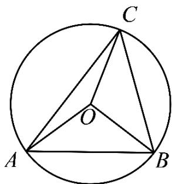

> [!faq]- 《专题22_解三角形精选压轴60题12类考点专练_高效培优期中专项训练_》官方解析
>
> > [!success]- **【答案】** B
>
> > [!note]- **【分析】**
> > 根据正弦定理求得 $R = \frac{2\sqrt{3}}{3}$ 将 $OC \cdot AB + CA \cdot CB$ 化为 $-2OC \cdot OA + OA \cdot OB + OC^2$ ，即 $\frac{2}{3} - \frac{8}{3}\cos \angle AOC$ ，即可求出答案.
>
> > [!note]- **【解析】**
> > 设VABC外接圆半径为R，
> >
> > 由正弦定理得 $\frac{AB}{\sin\angle ACB}=\frac{2}{\sin\frac{\pi}{3}}=\frac{4\sqrt{3}}{3}=2R$ ，所以 $R=\frac{2\sqrt{3}}{3}$ ，
> >
> > 由圆的性质得 $\angle AOB = 2\angle ACB = \frac{2\pi}{3}$
> >
> > $$
> > \stackrel {\text {   }} {O C} \cdot \stackrel {\text {   }} {A B} + \stackrel {\text {   }} {C A} \cdot \stackrel {\text {   }} {C B} = \stackrel {\text {   }} {O C} \cdot \left(\stackrel {\text {   }} {O B} - \stackrel {\text {   }} {O A}\right) + \left(\stackrel {\text {   }} {O A} - \stackrel {\text {   }} {O C}\right) \cdot \left(\stackrel {\text {   }} {O B} - \stackrel {\text {   }} {O C}\right)
> > $$
> >
> > $$
> > = - 2 O C \cdot O A + O A \cdot O B + O C ^ {2}
> > $$
> >
> > $$
> > = - 2 \times \left(\frac {2 \sqrt {3}}{3}\right) ^ {2} \cos \angle A O C + \left(\frac {2 \sqrt {3}}{3}\right) ^ {2} \times \cos \frac {2 \pi}{3} + \left(\frac {2 \sqrt {3}}{3}\right) ^ {2}
> > $$
> >
> > $$
> > = \frac {2}{3} - \frac {8}{3} \cos \angle A O C
> > $$
> >
> > 所以当 $\cos \angle AOC = -1$ ，即 $\angle AOC = \pi$ ，即 $\angle ABC = \frac{\pi}{2}$ 时，
> >
> > $OC \cdot AB + CA \cdot CB$ 取得最大值，最大值为 $\frac{10}{3}$ .
> >
> > 
