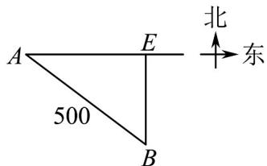
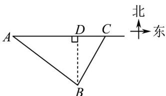

> [!faq]- 《专题22_解三角形精选压轴60题12类考点专练_高效培优期中专项训练_》官方解析
>
> > [!success]- **【答案】** (1)快艇应垂直于海岸向北行驶才能尽快把文件交到司机手中，最快需要4h (2)快艇至少以 60km/h 的速度行驶才能把文件送到司机手中
>
> > [!note]- **【分析】**
> > （1）设快艇以75km/h的速度沿BE行驶，t小时后与汽车在E处相遇，在 $\triangle ABE$ 中，利用余弦定
> >
> > 理，列出关于 $t$ 方程，求得 $t = 4$ ，即可求解；
> >
> > (2) 设快艇以 $v \mathrm{~km} / \mathrm{h}$ 的速度从 $B$ 处出发，沿 $BC$ 方向行驶， $t$ 小时后与汽车在 $C$ 处相遇，再设 $\angle BAC = \alpha$
> >
> > 在 $\vee ABC$ 中，利用余弦定理，求得 $v^{2} = \frac{250000}{t^{2}} -\frac{80000}{t} +10000$ ，结合二次函数的性质，即可求解
>
> > [!note]- **【解析】**
> > （1）解：如图所示，设快艇以75km/h的速度沿BE行驶，t小时后与汽车在E处相遇.
> >
> > 在 $\triangle ABE$ 中， $AB = 500\mathrm{km}$ ， $AE = 100t\mathrm{km}$ ， $BE = 75t\mathrm{km}$ ， $\cos \angle BAE = \frac{4}{5}$
> >
> > 由余弦定理得 $(75t)^2 = 500^2 + (100t)^2 - 2 \times 500 \times 100 + x\frac{4}{5}$ ，解得 $t = 4$ 或 $t = \frac{100}{7}$ （舍去），
> >
> > 当 $t = 4$ 时， $AE = 400\mathrm{km}$ ， $BE = 300\mathrm{km}$ ，则 $AB^{2} = AE^{2} + BE^{2}$
> >
> > 所以快艇应垂直于海岸向北行驶才能尽快把文件交到司机手中，最快需要4小时.
> >
> > 
> >
> > (2) 解：如图所示，设快艇以 $v \, km/h$ 的速度从 B 处出发，沿 BC 方向行驶，t 小时后与汽车在 C 处相遇.
> >
> > 在VABC中，AB=500km，AC=100tkm，BC=vtkm，
> >
> > 其中 BD 为 AC 边上的高，且 BD = 300km
> >
> > 设 $\angle BAC = \alpha$ ，则 $\sin \alpha = \frac{3}{5}$ ， $\cos \alpha = \frac{4}{5}$
> >
> > 由余弦定理得 $BC^{2} = AC^{2} + AB^{2} - 2AB \cdot AC \cos \alpha$ 即 $v^{2}t^{2}=(100t)^{2}+500^{2}-2\times500\times100t\times\frac{4}{5}$ ，
> > 整理得 $v^{2}=\frac{250000}{t^{2}}-\frac{80000}{t}+10000$ $=250000\left[\frac{1}{t^{2}}-\frac{8}{25}\times\frac{1}{t}+\left(\frac{4}{25}\right)^{2}\right]+10000-\frac{10000\times16}{25}=250000\left(\frac{1}{t}-\frac{4}{25}\right)^{2}+3600$ 当 $\frac{1}{t}=\frac{4}{25}$ ，即 $t=\frac{25}{4}$ 时， $v_{\min}^{2}=3600$ ，所以 $v_{\min}=60$ ，
> >
> > 即快艇至少以 60km/h 的速度行驶才能把文件送到司机手中.
> >
> > 
