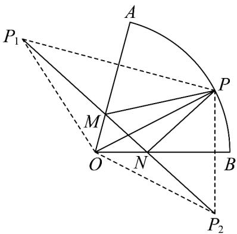

> [!faq]- 《专题22_解三角形精选压轴60题12类考点专练_高效培优期中专项训练_》官方解析
>
> > [!success]- **【答案】** A. 若 $\overrightarrow{AD} = \frac{1}{2}\left( \overrightarrow{AB} + \overrightarrow{AC} \right)$ ，则点 $D$ 是边 $BC$ 的中点 B. 若 $\overrightarrow{AD} = \frac{1}{3}\left( \frac{\overrightarrow{AB}}{|AB|\cos B} + \frac{\overrightarrow{AC}}{|AC|\cos C} \right)$ ，则直线 $AD$ 经过 $\forall ABC$ 的内心 C. 在 $\forall ABC$ 中，设 $\overrightarrow{AC^2} - \overrightarrow{AB^2} = 2\overrightarrow{AO} \cdot \overrightarrow{BC}$ ，那么动点 $O$ 的轨迹必通过 $\forall ABC$ 的外心 D. 在扇形 $OAB$ 中，半径 $|OA|=|OB|=2$ ，弧长为 $\frac{5\pi}{6}$ ，点 $P$ 是弧 $AB$ 上的动点，点 $M, N$ 分别是半径 $OA, OB$ 上的动点，则 $\triangle PMN$ 周长的最小值是 $\sqrt{6} + \sqrt{2}$
>
> > [!note]- **【分析】**
> > 根据中点的性质，可判定 A 正确；根据垂心的性质及数量积公式，可判定 B 正确；根据向量的运算得到 $BD = CB$ ，即可判断，可判定 C 正确；根据三点共线的性质，可判定 D 正确.
>
> > [!note]- **【解析】**
> > 对于 A，因为 $\overline{AD}=\frac{1}{2}\left(\overline{AB}+\overline{AC}\right)$ ，可得 $\frac{1}{2}\overline{AD}-\frac{1}{2}\overline{AB}=\frac{1}{2}\overline{AC}-\frac{1}{2}\overline{AD}$
> >
> > 所以 $AD - AB = AC - AD$ ，即 $BD = DC$ ，即点 D 是边 BC 的中点，故 A 正确；
> >
> > 对于 B，设 BC 的中点为 M，
> >
> > 可得 $\overrightarrow{AD} \cdot \overrightarrow{BC} = \frac{1}{3} \left( \frac{\overrightarrow{AB} \cdot \overrightarrow{BC}}{|AB| \cos B} + \frac{\overrightarrow{AC} \cdot \overrightarrow{BC}}{|AC| \cos C} \right) = \frac{1}{3} \left( -\left| \overrightarrow{BC} \right| + \left| \overrightarrow{BC} \right| \right) = 0$
> >
> > 即 $AD \perp BC$ ，故 $AD$ 过 $\forall ABC$ 的垂心，故 B 错误；
> >
> > 对于 C，因为 $AD = 2AB - AC$ ，即 $AD - AB = AB - AC$ ，所以 $BD = CB$ ，
> >
> > 即点 D 在边 CB 的延长线上，
> >
> > 设 $M$ 是 $BC$ 的中点，由 $\overline{AC}^2 -\overline{AB}^2 = \left( \overline{AC} +\overline{AB}\right)\cdot \left( \overline{AC} -\overline{AB}\right) = 2AO\cdot BC = 2AM\cdot BC$
> >
> > 即 $\left( \overline{AO} - \overline{AM} \right) \cdot \overline{BC} = \overline{MO} \cdot \overline{BC} = 0$ ，所以 $\overline{MO} \perp \overline{BC}$
> >
> > 所以动点 O 在线段 BC 的中垂线上，故动点 O 的轨迹必通过 $\vee ABC$ 的外心，所以 C 正确.
> >
> > 对于 D，连接 OP，作点 P 关于直线 OA 的对称点 $P_{1}$ ，关于直线 OB 的对称点 $P_{2}$ ，
> >
> > 连接 $P_{1}P_{2}$ 分别交OA，OB与点M,N，连接PM,PN如下图所示：
> >
> > $$
> > \text {则} \left| P M \right| = \left| P _ {1} M \right|, \left| P N \right| = \left| P _ {2} N \right|, \quad \left| O P \right| = \left| O P _ {1} \right| = \left| O P _ {2} \right| = 2
> > $$
> >
> > 则 $\triangle PMN$ 的周长的最小值即为 $\left|P_{1}P_{2}\right|$ 的长度.
> >
> > 因为扇形 OAB 的弧长为 $\frac{5\pi}{6}$ ，半径为 2，所以 $\angle AOB = \frac{5\pi}{12}$ ，
> >
> > 根据对称性知 $\angle P_{1}OA = \angle POA, \angle P_{2}OB = \angle POB$ ，所以 $\angle P_{1}OP_{2} = \frac{5\pi}{6}$
> >
> > 在 $^{\triangle}P_{1}POP_{2}$ 中，由余弦定理可得
> >
> > $$
> > \left| P _ {1} P _ {2} \right| ^ {2} = \left| O P _ {1} \right| ^ {2} + \left| O P _ {2} \right| ^ {2} - 2 \left| O P _ {1} \right| \left| O P _ {2} \right| \cos \angle P _ {1} O P _ {2} = 4 + 4 - 2 \times 2 \times 2 \times \left(- \frac {\sqrt {3}}{2}\right) = 8 + 4 \sqrt {3}
> > $$
> >
> > 所以 $\left|P_{1}P_{2}\right|=\sqrt{6}+\sqrt{2}$ ，即 $\triangle PMN$ 周长的最小值是 $\sqrt{6}+\sqrt{2}$
> >
> > 
