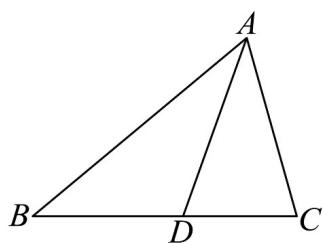
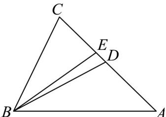

<!-- source-part:1 pages:1-50 -->

# 专题 22 解三角形精选压轴 60 题 12 类考点专练   (期中复习专项训练)

## 真题实战·百练通关

<table><tr><td>选填小压轴</td><td>解答压轴</td></tr><tr><td>题型1 余弦定理解三角形</td><td>题型8 证明三角形中的恒等式或不等式</td></tr><tr><td>题型2 余弦定理边角互化的应用</td><td>题型9 求三角形中的边长或周长的最值或范围</td></tr><tr><td>题型3 正弦定理判定三角形解的个数</td><td>题型10 求三角形面积的最值或范围</td></tr><tr><td>题型4 正弦定理边角互化的应用</td><td>题型11 正余弦定理与三角函数性质的综合应用</td></tr><tr><td>题型5 三角形面积公式及其应用</td><td>题型12 距离、高度、角度的测量问题</td></tr><tr><td>题型6 正余弦定理判定三角形形状</td><td></td></tr><tr><td>题型7 几何图形中的计算</td><td></td></tr></table>

题型一 余弦定理解三角形（共5小题）

1. 在 $\forall ABC$ 中， $AB = 4$ ， $BC = 5$ ， $AC = \sqrt{21}$ ， $D$ 为边 $AC$ 上一点，且 $BD$ 平分 $\angle ABC$ ，则 $BD = (\quad)$ A. $\frac{20\sqrt{3}}{9}$ B. $\frac{\sqrt{21}}{3}$ C. $\frac{9}{2}$ D. $\frac{14}{3}$

【答案】A

【分析】先根据三角形角平分线的性质确定 AD 的长度，再利用余弦定理求 $\cos A$ 和 BD 的长.

【详解】如图：

因为 BD 平分 $\angle ABC$ ，所以 $\frac{AD}{CD} = \frac{AB}{BC} = \frac{4}{5}$ ，又 $AC = \sqrt{21}$ ，所以 $AD = \frac{4\sqrt{21}}{9}$ 。

在 $\forall ABC$ 中，根据余弦定理，可得 $\cos A = \frac{AB^2 + AC^2 - BC^2}{2\cdot AB\cdot AC} = \frac{16 + 21 - 25}{8\sqrt{21}} = \frac{3}{2\sqrt{21}}$

在 $\triangle ABD$ 中，根据余弦定理， $BD^{2} = AB^{2} + AD^{2} - 2\cdot AB\cdot AD\cdot \cos A = 16 + \frac{16\times 21}{81} -2\times 4\times \frac{4\sqrt{21}}{9}\times \frac{3}{2\sqrt{21}}$

$$
= \frac {1 6 \times 2 5}{2 7}
$$

所以 $BD=\frac{4\times5}{3\sqrt{3}}=\frac{20\sqrt{3}}{9}$

2. 已知 $\forall ABC$ 的面积 $S = b^2 \sin A$ ，角 $A$ 的平分线 $AD$ 交 $BC$ 于 $D$ ， $AD = \frac{2\sqrt{3}}{3}$ ， $a = \sqrt{3}$ ，则 $b =$ \_\_\_\_.

【答案】1

【分析】由三角形的面积公式可得 $c = 2b$ ，由角平分线定理可得 $\frac{BD}{CD} = 2$ ，进而得 $BD = \frac{2\sqrt{3}}{3}$ $CD = \frac{\sqrt{3}}{3}$

在 $\triangle ABD$ 中，求得 $\cos \angle ABD = \frac{\sqrt{3}b}{2}$ ，最后在VABC中，由余弦定理求解即可.

【详解】依题知 $S = \frac{1}{2} bc \sin A = b^{2} \sin A$

则有 c = 2b ，

由角平分线定理可知： $\frac{BD}{CD} = \frac{AB}{AC} = \frac{c}{b} = 2$

所以 $BD = 2CD = \frac{2}{3} BC = \frac{2}{3} a = \frac{2\sqrt{3}}{3}$

所以 $CD=\frac{1}{3}a=\frac{\sqrt{3}}{3}$

在 $\triangle ABD$ 中，AB=c=2b

所以 $\cos\angle ABD=\frac{\frac{1}{2}AB}{AD}=\frac{b}{\frac{2\sqrt{3}}{3}}=\frac{\sqrt{3}b}{2}$

在VABC中，由余弦定理可得： $AC^{2}=AB^{2}+BC^{2}-2AB\cdot BC\cdot\cos\angle ABD$

即 $b^{2} = 4b^{2} + 3 - 6b^{2}$

解得b=1。

故答案为：1

3. $\forall ABC$ 中， $a = 2$ ， $c = 3$ ，若边 $AC$ 上的点 $D$ ， $E$ 满足 $AD = CD$ ， $BE$ 平分 $\angle B$ ，则 $BE^2 + 10DE$ 的最大

值为\_\_\_\_。

【答案】 $\frac{169}{24} / 7\frac{1}{24}$

【分析】利用角平分线定理结合已知条件设 AE = 3k ，则有 EC = 2k ，由 $\angle BEC + \angle BEA = 180^{\circ}$ 得到

$\cos \angle BEC + \cos \angle BEA = 0$ ，利用余弦定理分别求出 $\cos \angle BEC$ 和 $\cos \angle BEA$ ，将其代入

$\cos \angle BEC + \cos \angle BEA = 0$ 得到 $BE^{2} = 6 - 6k^{2}$ ，代入所求得到 $BE^{2} + 10DE = -6k^{2} + 5k + 6$ ，利用二次函数的

图象和性质求出最大值.

【详解】∵ a = 2，c = 3，BE 平分 ∠B，∴ $\frac{AE}{CE} = \frac{BA}{BC} = \frac{3}{2}$ ，

设 AE = 3k ，则有 EC = 2k ，

∵ D 是中点，∴ $DE = \frac{1}{2} k$

$\because \angle BEC + \angle BEA = 180^{\circ}$ $\therefore \cos \angle BEC + \cos \angle BEA = 0$

$\because \cos \angle BEC = \frac{EC^2 + BE^2 - BC^2}{EC \cdot BE}$

$$
\cos \angle B E A = \frac {E A ^ {2} + B E ^ {2} - B A ^ {2}}{E A \cdot B E}
$$

$$
\therefore \frac {E C ^ {2} + B E ^ {2} - B C ^ {2}}{E C \cdot B E} + \frac {E A ^ {2} + B E ^ {2} - B A ^ {2}}{E A \cdot B E} = 0
$$

$$
\therefore \frac {4 k ^ {2} + B E ^ {2} - 4}{2 k \cdot B E} + \frac {9 k ^ {2} + B E ^ {2} - 9}{3 k \cdot B E} = 0
$$

$$
\therefore B E ^ {2} = 6 - 6 k ^ {2}
$$

$$
\therefore B E ^ {2} + 1 0 D E = (6 - 6 k ^ {2}) + 1 0 \cdot \frac {1}{2} k = - 6 k ^ {2} + 5 k + 6,
$$

抛物线的对称轴为 $k = \frac{5}{12}$ ，开口向下，

则当 $k = \frac{5}{12}$ 时， $BE^2 + 10DE$ 取最大值为 $-6 \times \left(\frac{5}{12}\right)^2 + 5 \times \frac{5}{12} + 6 = \frac{169}{24}$

即 $BE^{2} + 10DE$ 的最大值为 $\frac{169}{24}$

故答案为： $\frac{169}{24}$

4．在VABC中，角A，B，C的对边分别为a，b，c，若 $a=5$ ， $c=a\cos B$ ，则VABC面积的最大值为（）A. $\frac{25}{4}$ B. $\frac{25}{2}$ C. $\frac{5}{2}$ D.5

【答案】A

$$
b ^ {2} + c ^ {2} = a ^ {2} = 2 5
$$

$$
\triangle A B C
$$

$$
\vee A B C
$$

的最大值，或由二倍角的正弦公式及正弦函数的最大值求得 $\vee ABC$ 面积的最大值.

【详解】因为 $c = a\cos B$ ，所以由余弦定理可得 $c = a\cdot \frac{a^2 + c^2 - b^2}{2ac}$

所以 $a^2 + c^2 - b^2 = 2c^2$ ，即 $b^2 + c^2 = a^2 = 25$

所以 $\triangle ABC$ 为直角三角形， $A = \frac{\pi}{2}$

所以VABC面积 $S_{\triangle ABC}=\frac{1}{2}bc\leq\frac{1}{2}\cdot\frac{b^{2}+c^{2}}{2}=\frac{25}{4}$

当且仅当 $b = c$ ，即 $b = c = \frac{5\sqrt{2}}{2}$ 时，等号成立.

所以 $\vee ABC$ 面积的最大值为 $\frac{25}{4}$

故选：A.

方法二：

因为 $c = a \cos B$ ，所以由余弦定理可得 $c = a \cdot \frac{a^{2} + c^{2} - b^{2}}{2ac}$ ，

所以 $a^{2}+c^{2}-b^{2}=2c^{2}$ ，即 $b^{2}+c^{2}=a^{2}=25$ ，

所以 $\triangle ABC$ 为直角三角形， $A=\frac{\pi}{2}$

所以 $b = a\sin B$ ，所以 $\vee ABC$ 面积 $S_{\triangle ABC} = \frac{1}{2} bc = \frac{1}{2} a^2\sin B\cos B = \frac{25}{4}\sin 2B.$

当 $\sin 2B = 1$ ，即 $2B = \frac{\pi}{2}, B = \frac{\pi}{4}$ 时， $\frac{25}{4} \sin 2B$ 取得最大值 $\frac{25}{4}$ ，即 $\bigvee ABC$ 面积的最大值为 $\frac{25}{4}$ .

故选：A.

5. 已知在 $\forall ABC$ 中， $AB = 3$ ， $AC = 5$ . $O$ 为 $\forall ABC$ 所在平面内一点，且满足 $\left|\overline{OA}\right| = \left|\overline{OB}\right| = \left|\overline{OC}\right|$ ， $D$ 为 $AC$ 的中点，且 $\overline{AO} = \frac{2\lambda}{3}\overline{AB} + \frac{3 - 2\lambda}{3}\overline{AD} (\lambda \neq 0)$ ，则 $\forall ABC$ 的面积为（）A.6 B. $\frac{15}{2}$ C. $\frac{5\sqrt{11}}{4}$ D. $\frac{3\sqrt{91}}{4}$

【答案】C

【分析】依题意可得 B, O, D 三点共线，即可得到 BD 垂直平分 AC，所以 BA = BC = 3，由余弦定理求出 $\cos\angle ABC$ ，从而求出 $\sin\angle ABC$ ，最后由面积公式计算可得.

【详解】因为 $AO=\frac{2\lambda}{3}AB+\frac{3-2\lambda}{3}AD(\lambda\neq0)$ ，又因为 $\frac{2\lambda}{3}+\frac{3-2\lambda}{3}=1$ ，所以 B,O,D 三点共线，又 $\left|OA\right|=\left|OB\right|=\left|OC\right|$ ，即 O 为 VABC 的外心，所以 OD 垂直平分 AC，即 BD 垂直平分 AC，

又已知 AB = 3 ，所以 BA = BC = 3 ，

又因为 AC = 5，所以由余弦定理有 $\cos\angle ABC = \frac{BA^{2} + BC^{2} - AC^{2}}{2BA \cdot BC} = \frac{3^{2} + 3^{2} - 5^{2}}{2 \times 3 \times 3} = -\frac{7}{18}$

又 $0 < \angle ABC < \pi$ ，所以 $\sin \angle ABC = \sqrt{1 - \cos^2\angle ABC} = \sqrt{1 - \left(-\frac{7}{18}\right)^2} = \frac{5\sqrt{11}}{18}$

所以 $S_{\triangle ABC} = \frac{1}{2} BA \times BC \sin \Phi ABC = \frac{1}{2}, 3', 3' \frac{5\sqrt{11}}{18} = \frac{5\sqrt{11}}{4}$

即VABC的面积为 $\frac{5\sqrt{11}}{4}$

故选：C

题型二 余弦定理边角互化的应用（共5小题）

6. $\forall ABC$ 的内角 $A, B, C$ 所对的边分别是 $a, b, c$ ，则下列命题正确的是（ ）A．若 $a^2 + b^2 < c^2$ ，则 $\forall ABC$ 是钝角三角形B．若 $a^2 + b^2 > c^2$ ，则 $\forall ABC$ 是锐角三角形C．若 $\sin A = \cos B$ ，则 $\forall ABC$ 是等腰三角形D．若 $\cos^2 \frac{A}{2} = \frac{b + c}{2c}$ ，则 $\forall ABC$ 是直角三角形

【答案】AD

【分析】由余弦定理易得 A 项正确；通过举反例，可迅速排除 B,C 项，对于 D，则先用降幂公式，再用

余弦定理，化简后即可判定直角三角形.

【详解】对于 A，由余弦定理， $\cos C=\frac{a^{2}+b^{2}-c^{2}}{2ab}<0$ ，因 $0<C<\pi$ ，故角 C 为钝角，

则 $\vee ABC$ 是钝角三角形，故A正确；

对于 B，若 a=4, b=5, c=3，显然满足 $a^{2}+b^{2}>c^{2}$ ，但此时 VABC 是直角三角形，故 B 错误；

对于 C，若 $A = 30^{\circ}, B = 60^{\circ}$ ，显然满足 $\sin A = \cos B$ ，但此时 VABC 是直角三角形，故 C 错误；

对于D，由 $\cos^2\frac{A}{2} = \frac{b + c}{2c}$ 可得， $\frac{1 + \cos A}{2} = \frac{b + c}{2c}$ ，即得， $b = c\cdot \cos A$

由余弦定理， $b=c\cdot\frac{b^{2}+c^{2}-a^{2}}{2bc}$ ，整理得， $a^{2}+b^{2}=c^{2}$ ，故VABC是直角三角形，即D正确.

故选：AD.

7. 在 $\forall ABC$ 中，角 $A, B, C$ 的对边分别为 $a, b, c$ ，若 $\left(a^2 + c^2 - b^2\right) \tan B = ac$ ，则角 $B$ 的大小为（） A. $\frac{\pi}{6}$ B. $\frac{\pi}{3}$ C. $\frac{5\pi}{6}$ D. $\frac{2\pi}{3}$

【答案】AC

【分析】将 $\left(a^{2}+c^{2}-b^{2}\right)\tan B=ac$ ，变形为 $\frac{a^{2}+c^{2}-b^{2}}{2ac}\cdot\frac{\sin B}{\cos B}=\frac{1}{2}$ 求解.

【详解】因为 $\left(a^{2}+c^{2}-b^{2}\right)\tan B=ac$

所以 $\frac{a^2 + c^2 - b^2}{2ac} \cdot \frac{\sin B}{\cos B} = \frac{1}{2}$

即 $\sin B = \frac{1}{2}$ ，

因为 $B \in (0, \pi)$ ，所以 $B = \frac{\pi}{6}$ 或 $\frac{5\pi}{6}$

故选：AC

8．在VABC中，内角A，B，C所对的边分别为a，b，c，若 $a=2b$ ，c=3，则BA·BC的取值范围是( ) A. (3,9) B. (6,18) C. $\left(\frac{18}{5},\frac{9}{2}\right)$ D. $\left(\frac{36}{5},9\right)$

【答案】B

【分析】先根据三角形两边之和大于第三边和两边之差小于第三边求出 $b$ 的取值范围，再结合数量积的

运算和余弦定理即可求解.

【详解】由题有 $\left\{\begin{aligned}|a-c|&<b<a+c\\ |a-b|&<c<a+b\end{aligned}\right.\Rightarrow\left\{\begin{aligned}|2b-3|&<b<2b+3\\ |2b-b|&<3<2b+b\end{aligned}\right.\Rightarrow\left\{\begin{aligned}-b&<2b-3<b\\ b&<3<3b\end{aligned}\right.\Rightarrow1<b<3\\ |b-3|&<2b<b+3\\ 3-b&<2b\text{且}b<3\end{aligned}\right.$

所以 $1 < b^{2} < 9$ ，故 $6 < \frac{3}{2} b^{2} + \frac{9}{2} < 18$

所以 $\overrightarrow{BA}\overrightarrow{BC}=ac\cos B=ac\times\frac{a^{2}+c^{2}-b^{2}}{2ac}=\frac{4b^{2}+9-b^{2}}{2}=\frac{3}{2}b^{2}+\frac{9}{2}\in(6,18)$

故选：B.

9．已知a,b,c分别为VABC的内角A,B,C的对边，且 $c(a\cos B-b\sin A)=a^{2}-b^{2}$ .角A=\_\_\_\_.

【答案】 $\frac{\pi}{4}$

【分析】利用余弦定理进行角化边，最后得到 $\sin A = \cos A$ ，最后利用正切值求解角度即可.

【详解】在 $\forall ABC$ 中，由余弦定理得， $\cos B = \frac{a^2 + c^2 - b^2}{2ac}$ ，代入得 $c(a\cos B - b\sin A) = a^2 - b^2$

则 $c\left(a \cdot \frac{a^2 + c^2 - b^2}{2ac} - b \sin A\right) = a^2 - b^2$ ，即 $a^2 + c^2 - b^2 - 2bc \sin A = 2a^2 - 2b^2$

即 $\sin A=\frac{b^{2}+c^{2}-a^{2}}{2bc}=\cos A$ ，因为 $A\in(0,\pi)$ ，但 $A=\frac{\pi}{2}$ 时上式不成立，

所以 $\cos A \neq 0$ ，所以 $\tan A = 1$ ，则 $A = \frac{\pi}{4}$ 。

故答案为： $\frac{\pi}{4}$

10. 在 $\forall ABC$ 中，角 $A, B, C$ 所对的边分别为 $a, b, c, c = 4, C = \frac{\pi}{3}$ ，则下列说法正确的是（）A. $b\cos A + a\cos B = 4$ B. 若 $b = 7$ ，则符合条件的三角形有两个C. $a^2 + b^2$ 的最大值为32D. $\frac{\cos B}{\cos A}$ 的取值范围为 $(- \infty, -2) \cup \left(-\frac{1}{2}, +\infty\right)$

【答案】ACD

【分析】由余弦定理将角化边，即可判断 A；利用正弦定理判断 B；由余弦定理及基本不等式判断 C，将

$\frac{\cos B}{\cos A}$ 转化为 $A$ 的三角函数，结合 $A$ 的范围及正切函数的性质判断D.

【详解】对于 A： $b \cos A + a \cos B = b \cdot \frac{b^{2} + c^{2} - a^{2}}{2bc} + a \cdot \frac{a^{2} + c^{2} - b^{2}}{2ac} = c = 4$ ，故 A 正确；

对于B：由正弦定理得 $\frac{b}{\sin B} = \frac{c}{\sin C}$ ，解得 $\sin B = \frac{b\sin C}{c} = \frac{7\sqrt{3}}{8} >1$

故符合条件的三角形不存在，故 B 错误；

对于 C：由余弦定理得 $c^{2}=a^{2}+b^{2}-2ab\cos C$

即 $16 = a^{2} + b^{2} - ab\quad a^{2} + b^{2} - \frac{a^{2} + b^{2}}{2}$

所以 $a^{2}+b^{2}\leq32$ ，当且仅当 a=b 时，等号成立，故 C 正确；

对于 D： $\frac{\cos B}{\cos A}=\frac{\cos\left[\pi-(A+C)\right]}{\cos A}=\frac{-\cos\left(A+\frac{\pi}{3}\right)}{\cos A}=\frac{\frac{\sqrt{3}}{2}\sin A-\frac{1}{2}\cos A}{\cos A}=\frac{\sqrt{3}}{2}\tan A-\frac{1}{2}$

因为 $A \in \left(0, \frac{2\pi}{3}\right)$ ，所以 $\tan A \in \left(-\infty, -\sqrt{3}\right) \cup (0, +\infty)$

所以 $\frac{\sqrt{3}}{2}\tan A - \frac{1}{2}\in (-\infty , - 2)\cup \left(-\frac{1}{2}, + \infty\right)$

即 $\frac{\cos B}{\cos A}$ 的取值范围为 $(-∞,-2)∪\left(-\frac{1}{2},+∞\right)$ ，故 D 正确.

故选：ACD.

![[高中/课堂同步/题库/人教A版高中数学同步讲义(2026)/02_必修第二册/期中专项训练+期中模拟卷/专项训练/专题22_解三角形精选压轴60题12类考点专练_高效培优期中专项训练_/题型三_正弦定理判定三角形解的个数_共5小题_sec_01/题型三_正弦定理判定三角形解的个数_共5小题_sec_01.md]]
![[高中/课堂同步/题库/人教A版高中数学同步讲义(2026)/02_必修第二册/期中专项训练+期中模拟卷/专项训练/专题22_解三角形精选压轴60题12类考点专练_高效培优期中专项训练_/题型四_正弦定理边角互化的应用_共5小题_sec_02/题型四_正弦定理边角互化的应用_共5小题_sec_02.md]]
![[高中/课堂同步/题库/人教A版高中数学同步讲义(2026)/02_必修第二册/期中专项训练+期中模拟卷/专项训练/专题22_解三角形精选压轴60题12类考点专练_高效培优期中专项训练_/题型六_正余弦定理判定三角形形状_共5小题_sec_03/题型六_正余弦定理判定三角形形状_共5小题_sec_03.md]]
![[高中/课堂同步/题库/人教A版高中数学同步讲义(2026)/02_必修第二册/期中专项训练+期中模拟卷/专项训练/专题22_解三角形精选压轴60题12类考点专练_高效培优期中专项训练_/题型七_几何图形中的计算_共5小题_sec_04/题型七_几何图形中的计算_共5小题_sec_04.md]]
![[高中/课堂同步/题库/人教A版高中数学同步讲义(2026)/02_必修第二册/期中专项训练+期中模拟卷/专项训练/专题22_解三角形精选压轴60题12类考点专练_高效培优期中专项训练_/题型九_求三角形中的边长或周长的最值或范围_共5小_sec_05/题型九_求三角形中的边长或周长的最值或范围_共5小_sec_05.md]]
![[高中/课堂同步/题库/人教A版高中数学同步讲义(2026)/02_必修第二册/期中专项训练+期中模拟卷/专项训练/专题22_解三角形精选压轴60题12类考点专练_高效培优期中专项训练_/题型十_求三角形面积的最值或范围_共5小题_sec_06/题型十_求三角形面积的最值或范围_共5小题_sec_06.md]]
