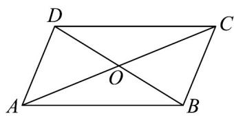

<!-- question-source:start -->
25. 如图，在平行四边形 $ABCD$ 中， $\overline{AC} = a, \overline{DO} = b$ ，则 $\overline{CB} = (\quad)$

A. $\frac{1}{2} a + b$

B. $-\frac{1}{2}a + b$

C. $-\frac{1}{2} a - b$

D. $\frac{1}{2} a - b$
<!-- question-source:end -->

![[高中/课堂同步/题库/人教A版高中数学同步讲义(2026)/02_必修第二册/期中专项训练+期中模拟卷/专题02 平面向量的运算（高效培优期中专项训练）数学人教A版高一必修第二册/专题02_平面向量的运算/questions/answers/Q00076866A1.md]]
