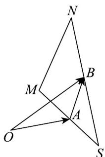

> [!faq]- 《专题02 平面向量的运算（高效培优期中专项训练）数学人教A版高一必修第二册》官方解析
>
> > [!success]- **【答案】** 2
>
> > [!note]- **【解析】**
> > 如图所示：
> >
> > 
> >
> > 因为 $AB$ 是 $\triangle SMN$ 的中位线，所以 $MN = 2AB$ ，因为 $\left|AB\right| = \left|\overline{OB} -\overline{OA}\right|$ ， $1\leq \left|\overline{OB} -\overline{OA}\right|\leq 3$
> >
> > 所以 $2 \leq \left|MN\right| \leq 6$
> >
> > 故答案为：2.
