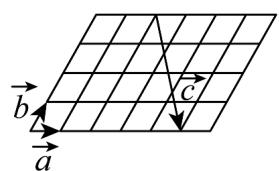
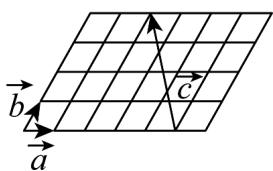
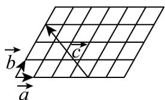
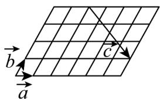

> [!faq]- 《专题02 平面向量的运算（高效培优期中专项训练）数学人教A版高一必修第二册》官方解析
>
> > [!success]- **【答案】**  B  C  D 
>
> > [!note]- **【解析】**
> > 由图象可知， $^{A}$ 选项，c=3a-4b；
> >
> > B选项，c=4b-3a；
> >
> > $C_{选项}$ ，c = 3b - 4a；
> >
> > D选项，c=4a-3b
> >
> > 故选 **D**.
