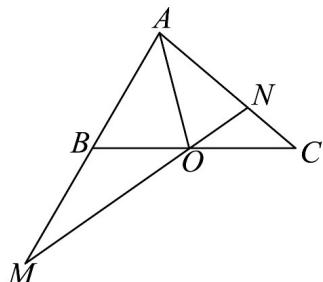
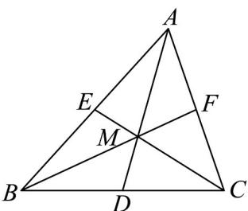

> [!faq]- 《专题02 平面向量的运算（高效培优期中专项训练）数学人教A版高一必修第二册》官方解析
>
> > [!success]- **【答案】**  A. BC = mAM - nAN B．若 O 是 BC 的中点，则 $\overline{AO} = \frac{1}{2} \overline{AB} + \frac{1}{2} \overline{AC}$ C. 若 $O$ 是 $BC$ 的中点，则 $m + n = 2$ D．若 $m=\frac{1}{3}, n=3$ ，则 $\left|\begin{matrix}BQ\\BC\end{matrix}\right|=\frac{1}{4}$
>
> > [!note]- **【解析】**
> > 解： $BC = AC - AB = nAN - mAM$ ，A 错误；
> >
> > 若 $O$ 是 $BC$ 的中点，则 $\overline{AO} = \frac{1}{2}\overline{AB} +\frac{1}{2}\overline{AC} = \frac{1}{2} mAM + \frac{1}{2} nAN$
> >
> > 由 $M, O, N$ 三点共线可设 $\overline{MO} = \mu MN (\mu \in \mathbf{R})$ ，则 $\overline{AO} - \overline{AM} = \mu (\overline{AN} - \overline{AM})$
> >
> > $$
> > \therefore A O = (1 - \mu) A M + \mu A N
> > $$
> >
> > $\therefore \frac{1}{2} m + \frac{1}{2} n = 1$ ，得 $m + n = 2$ ，B，C正确；
> >
> > 设 $BO = \lambda BC$ ，则 $AO = (1 - \lambda)AB + \lambda AC = \frac{1}{3}(1 - \lambda)AM + 3\lambda AN$ ，
> >
> > $\because M, O, N$ 三点共线， $\therefore \frac{1}{3} (1 - \lambda) + 3\lambda = 1$ ，得 $\lambda = \frac{1}{4}$ ，D 正确；
> >
> > 故选：BCD.
> >
> > ## 考点06根据向量关系判断三角形的心
> >
> > 38. “奔驰定理”是平面向量中一个非常优美的结论，因为这个定理对应的图形与“奔驰”轿车，
> >
> > (Mercedesbenz) 的 logo 很相似，故形象地称其为“奔驰定理”，奔驰定理：已知 M 是 VABC 内一点，
> >
> > △ BMC、△AMC、△AMB 的面积分别为 $S_{A}$ 、 $S_{B}$ 、 $S_{C}$ ，且 $S_{A} \cdot MA + S_{B} \cdot MB + S_{C} \cdot MC = 0$ 。则下列说法正确的是（）
> >
> > A. 若 $S_{A}: S_{B}: S_{C} = 1: 1: 1$ ，则 $M$ 为 $\vee ABC$ 的重心
> >
> > B．若 $S_{A}:S_{B}:S_{C}=1:2:3$ ，则 $\overline{AM}=\frac{1}{3}\overline{AB}+\frac{1}{2}\overline{AC}$
> >
> > C. 若 $AM = \frac{1}{4} AB + \frac{1}{3} AC$ ，则 $\frac{S_{A}}{S_{\triangle ABC}} = \frac{1}{3}$
> >
> > D．若 $M$ 为 $\vee ABC$ 的内心，且 $3\overline{MA} +4\overline{MB} +\sqrt{7}\overline{MC} = 0$ ，则 $\cos C = \frac{3}{4}$
> >
> > 【答案】ABD
> >
> > 【详解】对于 A 选项，若 $S_{A}:S_{B}:S_{C}=1:1:1$ ，则 $MA+MB+MC=0$
> >
> > 
> >
> > 取线段 $BC$ 的中点 $D$ ，连接 $DM$ ，则 $\overline{MB} +\overline{MC} = \left(\overline{MD} +\overline{DB}\right) + \left(\overline{MD} +\overline{DC}\right) = 2\overline{MD}$
> >
> > 所以， $\overline{MA}+\overline{MB}+\overline{MC}=\overline{MA}+2\overline{MD}=0$ ，即 $\overline{MA}=-2\overline{MD}$ ，故 A、M、D 三点共线，
> >
> > 分别取线段 AB 、 AC 的中点 E 、 F ，连接 ME 、 MF ，
> >
> > 同理可证 B、M、F 三点共线，C、M、E 三点共线，则 M 为 $\forall ABC$ 的重心，
> > 因此，若 $S_{A}:S_{B}:S_{C}=1:1:1$ ，则 M 为 $\forall ABC$ 的重心， $^{A}$ 对；
> >
> > 对于 B 选项，若 $S_{A}:S_{B}:S_{C}=1:2:3$ ，由“奔驰定理”可得 $\overline{MA}+2\overline{MB}+3\overline{MC}=0$
> >
> > 所以， $\overline{MA}+2\left(\overline{MA}+\overline{AB}\right)+3\left(\overline{MA}+\overline{AC}\right)=0$ ，所以， $6\overline{AM}=2\overline{AB}+3\overline{AC}$
> >
> > 故 $\overset{\square\square\square}{AM}=\frac{1}{3}\overset{\square\square\square}{AB}+\frac{1}{2}\overset{\square\square\square}{AC}$ ，B对；
> >
> > 对于 C 选项，若 $AM = \frac{1}{4} AB + \frac{1}{3} AC$ ，即 $12AM = 3AB + 4AC$ ，
> >
> > 即 $12\overline{AM} = 3\left(\overline{AM} + \overline{MB}\right) + 4\left(\overline{AM} + \overline{MC}\right)$ ，即 $5\overline{MA} + 3\overline{MB} + 4\overline{MC} = 0$ ，
> >
> > 又 $S_{A} \cdot \overline{MA} + S_{B} \cdot \overline{MB} + S_{C} \cdot \overline{MC} = 0$ ， $MA, MB, MC$ 不共线，
> >
> > 所以 $S_{A}: S_{B}: S_{C} = 5:3:4$
> >
> > 所以由“奔驰定理”可得 $\frac{S_A}{S_{\triangle ABC}} = \frac{S_A}{S_A + S_B + S_C} = \frac{5}{5 + 4 + 3} = \frac{5}{12} \neq \frac{1}{3}$ ，C 错；
> >
> > 对于 $^{D}$ 选项，若M为VABC的内心，设VABC的内切圆半径为r，
> >
> > 则 $S_{A}: S_{B}: S_{C} = \left(\frac{1}{2} BC \cdot r\right): \left(\frac{1}{2} AC \cdot r\right): \left(\frac{1}{2} AB \cdot r\right) = BC: AC: AB$
> >
> > 因为 $3\overline{MA} + 4\overline{MB} + \sqrt{7}\overline{MC} = 0$ ，则 $S_A: S_B: S_C = 3: 4: \sqrt{7}$ ，故 $BC: AC: AB = 3: 4: \sqrt{7}$ ，设 $BC = 3t(t > 0)$ ，则 $AC = 4t$ ， $AB = \sqrt{7}t$ ，则 $BC^2 + AB^2 = AC^2$ ，故 $\angle ABC$ 为直角，所以， $\cos C = \frac{BC}{AC} = \frac{3}{4}$ ，D 对.
> >
> > 故选 **ABD**.
