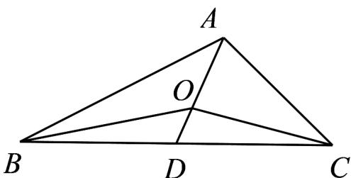
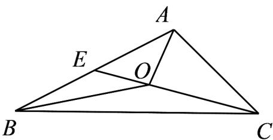

> [!faq]- 《专题02 平面向量的运算（高效培优期中专项训练）数学人教A版高一必修第二册》官方解析
>
> > [!success]- **【答案】** AD
>
> > [!note]- **【解析】**
> > 取 $BC$ 的中点 $D$ ，连接 $OD$ ，则 $\overline{OB} +\overline{OC} = 2\overline{OD}$ ，若 $\overline{OA} +\overline{OB} +\overline{OC} = 0$ ，则 $2\overline{OD} = -\overline{OA}$ ，则 $O,A,D$ 三点共线，且 $2\left|\overline{OD}\right| = \left|\overline{OA}\right|$ 则 $O$ 为VABC的重心，故A正确；
> >
> > 
> >
> > 若 $\left|\overline{OA}\right|=\left|\overline{OB}\right|=\left|\overline{OC}\right|$ ，则O为VABC的外心，不一定是内心，故 $^{B}$ 错误；
> >
> > 若 $O$ 为 $\vee ABC$ 的重心， $AD$ 是 $BC$ 边上的中线，则 $\left|AO\right| = \frac{2}{3}\left|AD\right|$ ，则 $3AO = 2AD$ ，故 $C$ 错误；取 $AB$ 的中点 $E$ ，连接 $OE$ ，则 $OA + OB = 2OE$ ，
> >
> > 
> >
> > 若 $\overline{OA} +\overline{OB} = \overline{CO}$ ，则 $CO = 2OE$ ，则 $O,D,E$ 三点共线，且 $\left|\overline{OE}\right| = \frac{1}{3}\left|\overline{CE}\right|$
> >
> > 则 $S_{\triangle AOB} = \frac{1}{3} S_{\triangle ABC}$ ，故D正确·
> >
> > 故选 **AD**.
