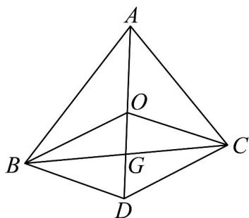

> [!faq]- 《专题02 平面向量的运算（高效培优期中专项训练）数学人教A版高一必修第二册》官方解析
>
> > [!success]- **【答案】** C
>
> > [!note]- **【解析】**
> > 作 $BD^{\parallel}OC$ ， $CD^{\parallel}OB$ ，连接 OD，OD 与 BC 相交于点 G，则 $BG=CG$ （平行四边形对角线互相平分）， $\therefore OB + OC = OD$
> >
> > 又 $OA + OB + OC = 0$ ，可得 $OB + OC = -OA$ ，∴ $OD = -OA$ ，
> >
> > $\therefore A, O, G$ 在一条直线上，可得 $AG$ 是 $BC$ 边上的中线，同理， $BO, CO$ 也在 $\triangle ABC$ 的中线上. 点 $O$ 为三角形 $ABC$ 的重心.
> >
> > 故选：C.
> >
> > 
