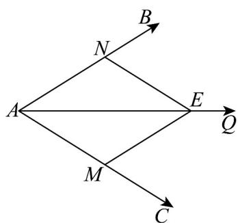

> [!faq]- 《专题02 平面向量的运算（高效培优期中专项训练）数学人教A版高一必修第二册》官方解析
>
> > [!success]- **【答案】** A
>
> > [!note]- **【解析】**
> > 因为 $\frac{AB}{|AB|}$ 是与 $\frac{AB}{AB}$ 同向的单位向量， $\frac{AC}{|AC|}$ 是与 $\frac{AC}{AC}$ 同向的单位向量，
> >
> > 
> >
> > 如图，设 $\frac{\overrightarrow{AN}}{\overrightarrow{AB}} = \frac{\overrightarrow{AB}}{\overrightarrow{AB}}$ , $\frac{\overrightarrow{AM}}{\overrightarrow{AC}} = \frac{\overrightarrow{AC}}{\overrightarrow{AC}}$
> >
> > 则 $\overrightarrow{OQ} = \overrightarrow{OA} + \lambda \left( \frac{\overrightarrow{AB}}{|AB|} + \frac{\overrightarrow{AC}}{|AC|} \right)$ 可化为： $\overrightarrow{AQ} = \lambda \left( \overrightarrow{AN} + \overrightarrow{AM} \right)$ ，且 AM = AN，
> > 以 AM，AN 为邻边作平行四边形 AMEN，
> > 则 $AE = AM + AN$ ，且平行四边形 AMEN 为菱形，所以 AE 平分 $\angle MAN$ ，
> > 所以 $AQ = \lambda AE$ 又 A 为公共端点，所以 A，E，Q 三点共线，所以 $\overrightarrow{AQ}$ 在 $\angle BAC$ 的平分线上，则 Q 点的轨迹必经过 VABC 的内心，
> >
> > 故选 **A**.
