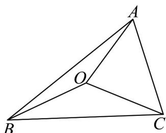
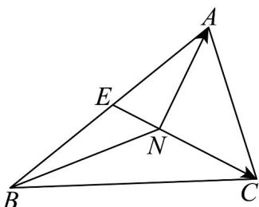
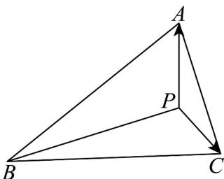

> [!faq]- 《专题02 平面向量的运算（高效培优期中专项训练）数学人教A版高一必修第二册》官方解析
>
> > [!success]- **【答案】** C
>
> > [!note]- **【解析】**
> > 
> >
> > 因为 $\left|OA\right|=\left|OB\right|=\left|OC\right|$ ，所以 O 到定点 A, B, C 的距离相等，
> >
> > 所以 O 为 VABC 的外心；
> >
> > 
> >
> > 由 $NA + NB + NC = 0$ ，则 $NA + NB = -NC$ ，取 $AB$ 的中点 $E$ ，则 $\overline{NA} +\overline{NB} = -2\overline{NE} = \overline{CN}$
> >
> > 所以 $2\left|\overline{NE}\right|=\left|\overline{CN}\right|$ ，所以 N 是 VABC 的重心；
> >
> > 
> >
> > 由 $\overline{PA} \cdot \overline{PB} = \overline{PB} \cdot \overline{PC} = \overline{PC} \cdot \overline{PA}$ ，得 $(\overline{PA} - \overline{PC}) \cdot \overline{PB} = 0$ ，即 $\overline{AC} \cdot \overline{PB} = 0$
> >
> > 所以 $AC \perp PB$ ，同理 $AB \perp PC$ ，所以点 P 为 $\forall ABC$ 的垂心.
> >
> > 故选 **C**.
