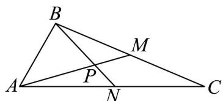

<!-- question-source:start -->
13．如图，在VABC中，已知AB=4,AC=10， $\angle BAC=60^{\circ}$ ，BC边上的中点为M，点N是边AC上的动点（不含端点），AM、BN相交于点P.

(1)当点 $N$ 为 $AC$ 中点时，求 $\angle MPN$ 的余弦值；

(2)求 $\overline{NA}\cdot\overline{NB}$ 的最小值；当 $\overline{NA}\cdot\overline{NB}$ 取得最小值时设 $\overline{BP}=\lambda\overline{BN}$ ，求 $\lambda$ 的值.
<!-- question-source:end -->

![[高中/课堂同步/题库/人教A版高中数学同步讲义(2026)/02_必修第二册/期中专项训练+期中模拟卷/专题03 向量的数量积（高效培优期中专项训练）数学人教A版高一必修第二册/专题03_向量的数量积/questions/answers/Q00076901A1.md]]
