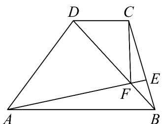

<!-- question-source:start -->
28. 如图，在梯形 $ABCD$ 中， $AB//CD$ ， $AB = 8$ ， $CD = 3$ ， $AD = 6$ ， $E$ 在线段 $BC$ 上。

(1)若 CE = 2EB，用向量 $\stackrel{\square\square}{AB}$ ， $\stackrel{\square\square}{AD}$ 表示 $\stackrel{\square\square\square}{CB}$ ， $\stackrel{\square\square\square}{AE}$ ；

(2) 若 $AE$ 与 $BD$ 交于点 $F$ , $\overline{DF} = x\overline{DB}\left(0 < x < 1\right)$ , $\cos \angle DAB = \frac{1}{3}$ , $\left|\overline{CF}\right| = 2\sqrt{2}$ , 求 $x$ 的值.
<!-- question-source:end -->

![[高中/课堂同步/题库/人教A版高中数学同步讲义(2026)/02_必修第二册/期中专项训练+期中模拟卷/专题03 向量的数量积（高效培优期中专项训练）数学人教A版高一必修第二册/专题03_向量的数量积/questions/answers/Q00076915A1.md]]
