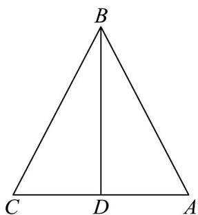

> [!faq]- 《专题03 向量的数量积（高效培优期中专项训练）数学人教A版高一必修第二册》官方解析
>
> > [!success]- **【答案】** B
>
> > [!note]- **【解析】**
> > 
> >
> > 如图，取 $AC$ 中点为 $D$ ，连接 $BD$
> >
> > 则 $BC + BA = 2BD$
> >
> > 又 $BC\cdot CA = CA\cdot AB$
> >
> > 即 $\left( BC + BA \right) \cdot CA = 2BD \cdot CA = 0$
> >
> > 所以 $BD \perp AC$
> >
> > 所以，VABC为等腰三角形， $\angle ABD=\frac{1}{2}\angle ABC$
> >
> > 又 $\left|\overline{BA} +\overline{BC}\right| = 2\sqrt{3}$ ，所以 $\left|\overline{BD}\right| = \sqrt{3}$
> >
> > 又 $BA = BD + DA$ ， $BC = BD + DC = BD - DA$
> >
> > 所以， $BA\cdot BC = (BD + DA)\cdot (BD - DA) = BD^2 -DA^2 = 3 - \left|DA\right|^2.$
> >
> > 在 $\mathrm{Rt}^{\triangle}ADB$ 中，有 $\tan \angle ABD = \frac{AD}{BD}$
> >
> > 所以， $AD = BD\tan \angle ABD = \sqrt{3}\tan \angle ABD.$
> >
> > 又 $\angle ABD = \frac{1}{2}\angle ABC$ ， $\frac{\pi}{3} \leq \angle ABC \leq \frac{2\pi}{3}$
> >
> > 所以 $\frac{\pi}{6} \leq \angle ABD \leq \frac{\pi}{3}$ , $\frac{\sqrt{3}}{3} \leq \tan \angle ABD \leq \sqrt{3}$ ,
> >
> > 所以， $1 \leq \sqrt{3} \tan \angle ABD \leq 3$ ， $1 \leq AD = \sqrt{3} \tan \angle ABD \leq 3$ ，
> >
> > 所以， $BA \cdot BC = 3 - \left|DA\right|^2$ 的取值范围为 $[-6, 2]$ .
> >
> > 故选 **B**.
