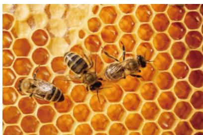
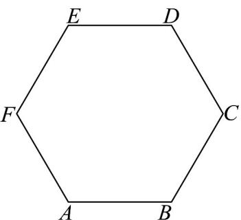
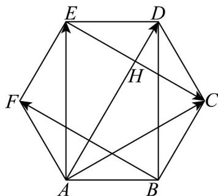

> [!faq]- 《专题03 向量的数量积（高效培优期中专项训练）数学人教A版高一必修第二册》官方解析
>
> > [!success]- **【答案】** D
>
> > [!note]- **【解析】**
> > 由 $|a - b| = 2a \cdot b$ ，可得 $a^2 - 2a \cdot b + b^2 = 4(a \cdot b)^2$ ，所以 $4(a \cdot b)^2 + 2a \cdot b - 2 = 0$ ，所以 $2\left(a \cdot b\right)^2 + a \cdot b - 1 = 0$ ，所以 $[2(a \cdot b) - 1](a \cdot b + 1) = 0$ ，解得 $a \cdot b = \frac{1}{2}$ 或 $a \cdot b = -1$ （舍去），所以 在 上的投影向量为 $\frac{a \cdot b}{|b|^2} \cdot b = \frac{1}{2}b$ 。
> >
> > 故选：D.
> >
> > 35. 蜜蜂的巢房是令人惊叹的神奇天然建筑物·巢房是严格的六角柱状体·它的一端是平整的六角形开口，另一端是封闭的六角菱形的底，由三个相同的菱形组成·巢中被封盖的是自然成熟的蜂蜜·如图是一个蜂巢的正六边形开口 $ABCDEF$ ，下列说法错误的是（）
> >
> > 【答案】
> >
> > 
> >
> > 
> >
> > A. $AC - AE = BF$ B. $AC + AE = \frac{1}{2} AD$ C. $AD \cdot AB = AD \cdot DE$ D. 在 AB 上的投影向量为 AB
> >
> > 【答案】ABC
> >
> > 【详解】对于 A， $AC - AE = EC$ ，而 $EC$ 与 $BF$ 为相反向量，A 错误；
> >
> > 
> >
> > 对于 $^{B}$ ，AD平分正 $^{\triangle}$ ACE 的内角∠EAC交EC于H，则 $AC + AE = 2AH$
> >
> > 在 Rt△EDH, Rt△AEH 中，∠DEH = ∠EAH = $\frac{\pi}{6}$ ，|AH|=√3 |EH|=3 |DH|，
> >
> > 则 $|AD|=4|DH|=\frac{4}{3}|AH|$ ，因此 $AC+AE=\frac{3}{2}AD$ ，B错误；
> >
> > 对于 C， $AB = -DE$ ，则 $AD \cdot AB = -AD \cdot DE$ 。C 错误；
> >
> > 对于 D， $\angle ABD=\frac{\pi}{2}$ ，则 $\underset{AD}{\cup}$ 在 $\underset{AB}{\cup}$ 上的投影向量为 $\underset{AB}{\cup}$ ，D 正确。
> >
> > 故选 **ABC**
