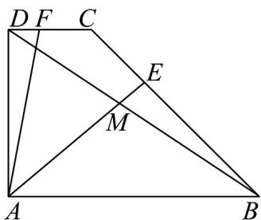

<!-- question-source:start -->
10．如图，在直角梯形ABCD中， $AB//DC$ ， $AD\perp AB$ ，CD=1，AD=2，AB=3，E，F分别是线段BC和DC上的动点，AE交BD于点M，且 $\overline{BE}=\lambda\overline{BC}$ ， $\overline{DF}=(1-\lambda)\overline{DC}$ ， $\lambda\in[0,1]$ .

(1)若 $AE \cdot BC = 0$ ，求 $\lambda$ 的值；

(2)当 $\lambda = \frac{1}{3}$ 时，求 $\frac{DM}{DB}$ 的值；

(3)求 $\left|\frac{1}{2}AF+\frac{1}{2}AE\right|$ 的取值范围.
<!-- question-source:end -->

![[高中/课堂同步/题库/人教A版高中数学同步讲义(2026)/02_必修第二册/期中专项训练+期中模拟卷/专题04 平面向量基本定理及坐标表示（高效培优期中专项训练）数学人教A版高一必修第二册/专题04_平面向量基本定理及坐标表示/questions/answers/Q00076931A1.md]]
