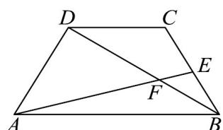

<!-- question-source:start -->
19. 如图，在等腰梯形 $ABCD$ 中， $AB = 2CD = 4$ ， $\angle BAD = \frac{\pi}{3}$ ， $E$ 是 $BC$ 边上一点（含端点）， $AE$ 与 $BD$ 交于点 $F$ ，设 $BE = \lambda BC$ 。

(1)若 $\overline{AF} = x\overline{AB} + y\overline{AD}$ ，证明： $x + y = 1$ ；

(2)若 $\lambda = \frac{1}{2}$ ， $A F = x A B + y A D$ ，求 $10x - 5y$ 的值；

(3)求 $AE \cdot BD$ 的取值范围.
<!-- question-source:end -->

![[高中/课堂同步/题库/人教A版高中数学同步讲义(2026)/02_必修第二册/期中专项训练+期中模拟卷/专题04 平面向量基本定理及坐标表示（高效培优期中专项训练）数学人教A版高一必修第二册/专题04_平面向量基本定理及坐标表示/questions/answers/Q00076940A1.md]]
