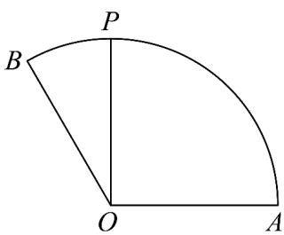

<!-- question-source:start -->
28. 如图，在扇形 $AOB$ 中，扇形的半径为 $1, \angle AOB = \frac{2\pi}{3}$ ，点 $P$ 在弧 $\square_{AB}$ 上移动， $OP = aOA + bOB$ 。当 $\angle AOP = \frac{\pi}{2}$ 时， $a + b = (\quad)$

A. $\frac{3}{2}$ B. $\sqrt{3}$ C. 2 D. $\frac{3\sqrt{3}}{2}$
<!-- question-source:end -->

![[高中/课堂同步/题库/人教A版高中数学同步讲义(2026)/02_必修第二册/期中专项训练+期中模拟卷/专题04 平面向量基本定理及坐标表示（高效培优期中专项训练）数学人教A版高一必修第二册/专题04_平面向量基本定理及坐标表示/questions/answers/Q00076947A1.md]]
