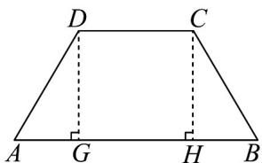

> [!faq]- 《专题04 平面向量基本定理及坐标表示（高效培优期中专项训练）数学人教A版高一必修第二册》官方解析
>
> > [!success]- **【答案】** (1)证明见解析 (2)4 (3) $AE \cdot BD \in [-12, -6]$
>
> > [!note]- **【解析】**
> > （1）由 $B, F, D$ 三点共线，可知存在实数 $m$ ，使 $\overline{BF} = m\overline{BD}$ ，即 $\overline{AF} - \overline{AB} = m\left(\overline{AD} - \overline{AB}\right)$ ，化简得 $\overline{AF} = m\overline{AD} + (1 - m)\overline{AB}$ 结合 $\overline{AF} = x\overline{AB} + y\overline{AD}$ ，由平面向量基本定理得 $\left\{\begin{array}{l}x = 1 - m \\ y = m\end{array}\right.$ ，所以 $x + y = 1$ 。
> >
> > (2) 在等腰梯形 ABCD 中，由 $AB + BC + CD + DA = 0$ ，
> >
> > 可得 $BC = -AB - CD - DA = -AB + DC + AD$
> >
> > 根据 $\left|AB\right|=2\left|CD\right|$ ，可得 $BC=-AB+\frac{1}{2}AB+AD=\frac{1}{2}AD-\frac{1}{2}AB$
> >
> > 又 $\overline{BE} = \frac{1}{2}\overline{BC}$ ，所以 $BE = \frac{1}{2} AD - \frac{1}{4} AB$
> >
> > 所以 $AE = AB + BE = \frac{3}{4} AB + \frac{1}{2} AD$
> >
> > 因为 A, F, E 三点共线，所以向量 $\overline{AE}, \overline{AF}$ 互相平行，
> >
> > 可得 $\frac{x}{\frac{3}{4}} = \frac{y}{\frac{1}{2}}$ ，结合 $x + y = 1$ ，解得 $\left\{ \begin{array}{l} x = \frac{3}{5} \\ y = \frac{2}{5} \end{array} \right.$
> >
> > 所以 $10x - 5y = 4$
> >
> > (3) 由 (1) 的结论，可得 $AE = AB + BE = AB + \lambda BC = \left(1 - \frac{\lambda}{2}\right)AB + \lambda AD$
> >
> > 过 D, C 作 AB 的垂线，垂足分别为 G, H
> >
> > 因为等腰梯形 $ABCD$ 中， $\left|AB\right| = 2\left|\overline{AB}\right| = 4$
> >
> > 所以 $\left|\overline{CD}\right|+2\left|\overline{AG}\right|=\left|\overline{AB}\right|$ ，可得 $\left|\overline{AG}\right|=\frac{1}{2}\left(\left|\overline{AB}\right|-\left|\overline{CD}\right|\right)=1$
> >
> > 又 $\angle BAD = \frac{\pi}{3}$ ，得 $\left|AD\right| = 2$
> >
> > 所以 $\overline{AB} \cdot \overline{AD} = \left|\overline{AB}\right| \left|\overline{AD}\right| \cos \frac{\pi}{3} = 4$ ， $AB^{2} = 16, AD^{2} = 4$ ，可得 $AE \cdot BD = \left[ \left( 1 - \frac{\lambda}{2} \right) AB + \lambda AD \right] \cdot \left( AD - AB \right)$ $= -\left( 1 - \frac{\lambda}{2} \right) AB^{2} + \lambda AD^{2} + \left( 1 - \frac{3}{2} \lambda \right) AB \cdot AD$ $= -12 + 6\lambda$ 结合 $\lambda \in [0,1]$ ，可得 $AE \cdot BD \in [-12,-6]$ .
> >
> > 
