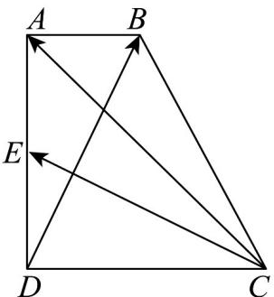
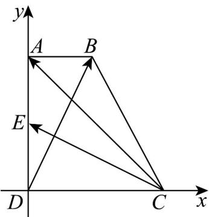

> [!faq]- 《专题04 平面向量基本定理及坐标表示（高效培优期中专项训练）数学人教A版高一必修第二册》官方解析
>
> > [!success]- **【答案】**  A. $\frac{6}{5}$ B. $\frac{8}{5}$ C. 2 D. $\frac{8}{3}$
>
> > [!note]- **【解析】**
> > 解：建立如图所示平面直角坐标系：
> >
> > 
> >
> > 则 $D(0,0), C(4,0), A(0,4), B(2,4), E(0,2)$
> >
> > 所以 $\overline{CA} = (-4, 4)$ , $\overline{CE} = (-4, 2)$ , $\overline{DB} = (2, 4)$ ,
> >
> > 因为 $CA = \lambda CE + \mu DB(\lambda, \mu \in \mathbf{R})$
> >
> > 所以 $(-4, 4) = \lambda (-4, 2) + \mu (2, 4)$
> >
> > 则 $\left\{ \begin{array}{l} -4\lambda + 2\mu = -4 \\ 2\lambda + 4\mu = 4 \end{array} \right.$ ，解得 $\lambda = \frac{6}{5}, \mu = \frac{2}{5}$ ，
> >
> > 所以 $\lambda + \mu = \frac{8}{5}$
> >
> > 故选 **B**
