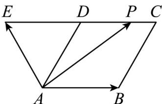
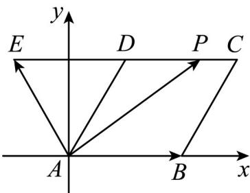

> [!faq]- 《专题04 平面向量基本定理及坐标表示（高效培优期中专项训练）数学人教A版高一必修第二册》官方解析
>
> > [!success]- **【答案】**  A. 满足 $\lambda + \mu = 1$ 的点 $P$ 有且只有一个 B. 满足 $\lambda + \mu = 2$ 的点 $P$ 有两个 C. $\lambda + \mu$ 存在最小值 D. $\lambda + \mu$ 不存在最大值
>
> > [!note]- **【解析】**
> > 建立如图所示的平面直角坐标系，设菱形ABCD的边长为1， $P(x,y)$ ，则
> >
> > $$
> > A (0, 0), B (1, 0), C \left(\frac {3}{2}, \frac {\sqrt {3}}{2}\right), D \left(\frac {1}{2}, \frac {\sqrt {3}}{2}\right), E \left(- \frac {1}{2}, \frac {\sqrt {3}}{2}\right)
> > $$
> >
> > 所以 $\overrightarrow{AB}=(1,0)$ , $\overrightarrow{AE}=\left(-\frac{1}{2},\frac{\sqrt{3}}{2}\right)$ ， $\overrightarrow{AP}=(x,y)$
> >
> > 由 $\overline{AP} = \lambda \overline{AB} +\mu \overline{AE}$ ，得 $(x,y) = \lambda (1,0) + \mu \left(-\frac{1}{2},\frac{\sqrt{3}}{2}\right) = \left(\lambda -\frac{1}{2}\mu ,\frac{\sqrt{3}}{2}\mu\right)$
> >
> > 所以 $\left\{ \begin{array}{ll}x = \lambda -\frac{1}{2}\mu \\ y = \frac{\sqrt{3}}{2}\mu \end{array} \right.$ ，所以 $\lambda +\mu = x + \sqrt{3} y$
> > - **①**：当点 P 在 AB 上时， $0 \leq x \leq 1$ ，且 y = 0
> >
> > 所以 $\lambda + \mu = x + \sqrt{3}y = x \in [0,1]$ ;
> > - **②**：当点 $P$ 在 $BC$ （不含点 $B$ ）上时，则 $\overline{BP} = m\overline{BC}$ ，所以 $(x - 1, y) = m\left(\frac{1}{2}, \frac{\sqrt{3}}{2}\right)$ ，化简 $y = \sqrt{3}(x - 1)$ ，所以 $\lambda + \mu = x + \sqrt{3}y = x + 3(x - 1) = 4x - 3$ ，
> >
> > 因为 $1 < x \leq \frac{3}{2}$ ，所以 $1 < 4x - 3 \leq 3$ ，即 $\lambda + \mu \in (1, 3]$ ；
> > - **③**：当点 $P$ 在 $CD$ （不含点 $C$ ）上时， $\frac{1}{2} \leq x < \frac{3}{2}$ ，且 $y = \frac{\sqrt{3}}{2}$ ，
> >
> > 所以 $\frac{1}{2} +\frac{3}{2}\leq x + \sqrt{3} y <   \frac{3}{2} +\frac{3}{2}$ ，即 $2\leq x + \sqrt{3} y <   3$ ，所以 $\lambda +\mu \in [2,3)$
> > - **④**：当点 $P$ 在 $AD$ （不含点 $A$ 、 $D$ ）上时，则 $\underset{AP=nAD}{\cup}$ ，所以 $(x,y)=n\left(\frac{1}{2},\frac{\sqrt{3}}{2}\right)$ ，化简 $y=\sqrt{3}x$ ，
> >
> > 所以 $\lambda + \mu = x + \sqrt{3}y = x + 3x = 4x$
> >
> > 因为 $0 < x < \frac{1}{2}$ ，所以 $0 < 4x < 2$ ，所以 $\lambda + \mu \in (0, 2)$ ;
> >
> > 对于 A，由①知，当 $\lambda + \mu = 1$ 时，x = 1，此时点 P 与点 B 重合；
> >
> > 由④可知当 $\lambda +\mu = 1$ 时， $x = \frac{1}{4}$ ， $y = \frac{\sqrt{3}}{4}$ ，此时点 $P$ 在 $AD$ 的中点处；
> >
> > 其它均不可能，所以这样的点 P 有两个，所以 A 错误，
> >
> > 对于 $^{B}$ ，由②知，当 $\lambda + \mu = 2$ 时， $x = \frac{5}{4}$ ， $y = \frac{\sqrt{3}}{4}$ ，此时点 $P$ 在 $BC$ 的中点；
> >
> > 由③知，当 $\lambda +\mu = 2$ 时， $x = \frac{1}{2}$ ， $y = \frac{\sqrt{3}}{2}$ ，此时点 $P$ 在点 $D$ 处；
> >
> > 其它均不可能，所以这样的点 P 有两个，所以 B 正确，
> >
> > 对于 CD，由①②③④可得：
> >
> > 当 x = y = 0 ，即点 P 为点 A 时， $\lambda + \mu$ 取到最小值 0；
> >
> > 当 $x = \frac{3}{2}, y = \frac{\sqrt{3}}{2}$ ，即点 $P$ 为点 $C$ 时， $\lambda + \mu$ 取到最大值 $^{3}$ ，所以 $C$ 正确， $D$ 错误，
> >
> > 故选：BC.
> >
> > 
