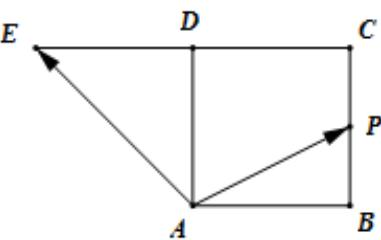
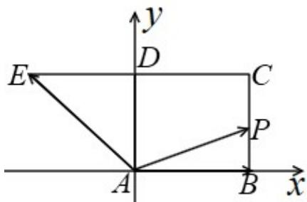

> [!faq]- 《专题04 平面向量基本定理及坐标表示（高效培优期中专项训练）数学人教A版高一必修第二册》官方解析
>
> > [!success]- **【答案】**  A. 满足 $\lambda + \mu = 2$ 的点 $P$ 必为 $BC$ 的中点 B. 满足 $\lambda + \mu = 1$ 的点 $P$ 有且只有一个 C. 满足 $\lambda + \mu = 3$ 的点 $P$ 有且只有一个 D. $\lambda + \mu = \frac{3}{2}$ 的点 $P$ 有且只有一个
>
> > [!note]- **【解析】**
> > 如图建系，取 AB = 1，∵ $AE = AD + DE = AD - AB$ ，
> >
> > 
> >
> > $$
> > A P = \lambda A B + \mu A E = (\lambda - \mu) A B + \mu A D = (\lambda - \mu) (1, 0) + \mu (0, 1) = (\lambda - \mu , \mu)
> > $$
> >
> > 动点 P 从点 A 出发，沿正方形的边按逆时针方向运动一周回到 A 点，
> >
> > 当 $P \in AB$ 时，有 $0 \leq \lambda - \mu \leq 1$ 且 $\mu = 0$ ， $\therefore 0 \leq \lambda \leq 1$ ， $\therefore 0 \leq \lambda + \mu \leq 1$
> >
> > 当 $P \in BC$ 时，有 $\lambda - \mu = 1$ 且 $0 \leq \mu \leq 1$ ，则 $\lambda = \mu + 1$ ， $\therefore 1 \leq \lambda \leq 2$ ， $\therefore 1 \leq \lambda + \mu \leq 3$
> >
> > 当 $P \in CD$ 时，有 $0 \leq \lambda - \mu \leq 1$ 且 $\mu = 1$ ，则 $\mu \leq \lambda \leq \mu + 1$ ， $\therefore 1 \leq \lambda \leq 2$ ， $\therefore 2 \leq \lambda + \mu \leq 3$
> >
> > 当 $P \in AD$ 时，有 $\lambda - \mu = 0$ 且 $0 \leq \mu \leq 1$ ，则 $\lambda = \mu$ ， $\therefore 0 \leq \lambda \leq 1$ ， $\therefore 0 \leq \lambda + \mu \leq 2$
> >
> > 综上， $0 \leq \lambda + \mu \leq 3$
> >
> > 选项 A，取 $\lambda = \mu = 1$ ，满足 $\lambda + \mu = 2$ ，此时 $AP = AB + AE = AD$ ，因此点 P 不一定是 BC 的中点，故 A 错误；
> >
> > 选项 $^{B}$ ，当点P取B点或AD的中点时，均满足 $\lambda+\mu=1$ ，此时点P有两个，故 $^{B}$ 错误；
> >
> > 选项 C，当点 P 取 C 点时， $\lambda - \mu = 1$ 且 $\mu = 1$ ，解得 $\lambda = 2$ ， $\lambda + \mu$ 为 3，故 C 正确；
> >
> > 选项D，当点 $P$ 在 $BC, CD, AD$ 上时，均可能满足 $\lambda + \mu = \frac{3}{2}$ ，此时点 $P$ 有三个，故D错误；
> >
> > 故选：C.
> >
> > ## 考点08线段的定比分点
