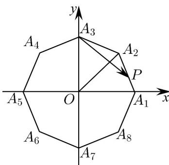

> [!faq]- 《专题04 平面向量基本定理及坐标表示（高效培优期中专项训练）数学人教A版高一必修第二册》官方解析
>
> > [!success]- **【答案】** 0 $\left[1,\sqrt{2}\right]$ $$ A _ {i} A _ {i + 4} (i = 1, 2, 3, 4) $$ 则 $\overline{OA}_1 + \overline{OA}_5 = \overline{OA}_2 + \overline{OA}_6 = \overline{OA}_3 + \overline{OA}_7 = \overline{OA}_4 + \overline{OA}_8 = 0$ ，所以， $\sum_{i=1}^{8}\overline{OA}_i = 0$ 故 $\square\square\dot{\square}OP\cdot\sum_{i=1}^{8}\square\square\dot{\square}OA_{i}=0$ ； 在正八边形 $A_{1}A_{2}\dots A_{8}$ 中， $\angle A_1OA_2 = \frac{360^\circ}{8} = 45^\circ$ ，则 $\angle A_1OA_3 = 2\angle A_1OA_2 = 90^\circ$ 以 $O$ 为坐标原点， $\overline{OA}_1$ 、 $\overline{OA}_3$ 的方向分别为 $x$ 、 $y$ 轴的正方向建立如下图所示的平面直角坐标系，  则 $A_{1}(1,0)$ 、 $A_{2}\left(\frac{\sqrt{2}}{2},\frac{\sqrt{2}}{2}\right)$ 、 $A_{3}(0,1)$ 、 $A_{4}\left(-\frac{\sqrt{2}}{2},\frac{\sqrt{2}}{2}\right)$ 所以， $A_{1}A_{2} = \left(\frac{\sqrt{2}}{2} -1,\frac{\sqrt{2}}{2}\right)$ ， $A_{3}A_{1} = (1, - 1)$ ， $A_{3}A_{2} = \left(\frac{\sqrt{2}}{2},\frac{\sqrt{2}}{2} -1\right)$ ， $A_{3}A_{4} = \left(-\frac{\sqrt{2}}{2},\frac{\sqrt{2}}{2} -1\right)$ 设 $\square A_{1}P = \lambda A_{1}A_{2}$ ，其中 $\lambda \in [0,1]$ ，则 $A_{3}P = A_{3}A_{1} + A_{1}P = A_{3}A_{1} + \lambda A_{1}A_{2} = (1, - 1) + \lambda \left(\frac{\sqrt{2}}{2} -1,\frac{\sqrt{2}}{2}\right)$ $= \left(1 + \left(\frac{\sqrt{2}}{2} -1\right)\lambda ,\frac{\sqrt{2}}{2}\lambda -1\right)$ 因为 $\overline{A_3P} = x\overline{A_3A_2} +y\overline{A_3A_4}$ ，即 $\left(1 + \left(\frac{\sqrt{2}}{2} -1\right)\lambda ,\frac{\sqrt{2}}{2}\lambda -1\right) = x\left(\frac{\sqrt{2}}{2},\frac{\sqrt{2}}{2} -1\right) + y\left(-\frac{\sqrt{2}}{2},\frac{\sqrt{2}}{2} -1\right)$ $= \left(\frac{\sqrt{2}}{2}\big(x - y\big),\left(\frac{\sqrt{2}}{2} -1\right)\big(x + y\big)\right)$ 所以， $1+\left(\frac{\sqrt{2}}{2}-1\right)\lambda=\frac{\sqrt{2}}{2}(x-y)$ ，即 $x-y=\sqrt{2}+\left(1-\sqrt{2}\right)\lambda\in\left[1,\sqrt{2}\right]$ 故答案为：0； $\left[1,\sqrt{2}\right]$
>
> > [!note]- **【解析】**
> > 本题未单列解析。
