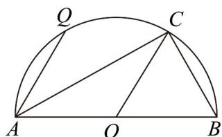

<!-- question-source:start -->
3. 如图，AB 为半圆 O 的直径， $\left|AB\right|=2$ ，C 为 AB 上一点（不含端点）.

(1)用向量的方法证明 $AC \perp BC$ ;

(2) 若 $C$ 是 $\square AB$ 上更靠近点 $B$ 的三等分点， $Q$ 为 $\square AC$ 上的任意一点（不含端点），求 $\square QA \cdot \square CB$ 的最大值.
<!-- question-source:end -->

![[高中/课堂同步/题库/人教A版高中数学同步讲义(2026)/02_必修第二册/期中专项训练+期中模拟卷/专题06 平面向量的应用（高效培优期中专项训练）数学人教A版高一必修第二册/专题06_平面向量的应用/questions/answers/Q00076967A1.md]]
