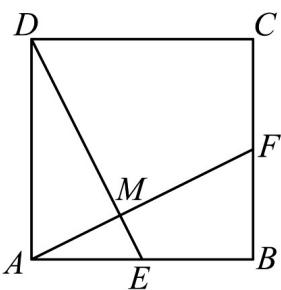

<!-- question-source:start -->
4．如图所示，已知在正方形ABCD中，E，F分别是边AB，BC的中点，AF与DE交于点M.

(1)设 $AB = a$ ， $AD = b$ ，用 $a$ ， $b$ 表示 $AF$ ， $DE$ ；

(2)猜想 $AF$ 与 $DE$ 的位置关系，写出你的猜想并用向量法证明你的猜想·
<!-- question-source:end -->

![[高中/课堂同步/题库/人教A版高中数学同步讲义(2026)/02_必修第二册/期中专项训练+期中模拟卷/专题06 平面向量的应用（高效培优期中专项训练）数学人教A版高一必修第二册/专题06_平面向量的应用/questions/answers/Q00076968A1.md]]
