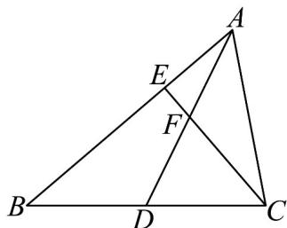

<!-- question-source:start -->
14. 如图，在 $\mathrm{V}ABC$ 中， $AB = 3, AC = 2, \angle BAC = \frac{\pi}{3}, D$ 是 $BC$ 边的中点， $CE \perp AB, AD$ 与 $CE$ 交于点 $F$ .

(1)求 $CE$ 和 $AD$ 的长度；

(2)求 $\cos \angle CFD$
<!-- question-source:end -->

![[高中/课堂同步/题库/人教A版高中数学同步讲义(2026)/02_必修第二册/期中专项训练+期中模拟卷/专题06 平面向量的应用（高效培优期中专项训练）数学人教A版高一必修第二册/专题06_平面向量的应用/questions/answers/Q00076978A1.md]]
