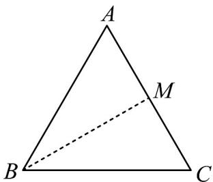

> [!faq]- 《专题06 平面向量的应用（高效培优期中专项训练）数学人教A版高一必修第二册》官方解析
>
> > [!success]- **【答案】** B
>
> > [!note]- **【解析】**
> > 如下图所示：
> >
> > 
> >
> > 设 $M$ 为 $AC$ 中点，则 $\left(BA + BC\right) \cdot AC = 2BM \cdot AC = 0$
> >
> > 所以 $BM \perp AC$ ，即 VABC 为等腰三角形，
> >
> > 又 $\left|\frac{\square\square\square}{\square\square\square}\frac{\square\square\square}{\left|\begin{matrix}AB\\ AB\end{matrix}\right|}+\frac{\square\square\square}{\left|\begin{matrix}AC\\ AC\end{matrix}\right|}=\sqrt{3}\right.$ ，所以 $\left|\frac{\square\square\overrightarrow{AB}}{\left|\begin{matrix}AB\\ AB\end{matrix}\right|}+\frac{\square\square\overrightarrow{AC}}{\left|\begin{matrix}AC\\ AC\end{matrix}\right|}\right|^{2}=3$ ，
> >
> > 即 $\left(\frac{\overrightarrow{AB}}{|AB|}\right)^2 +\left(\frac{\overrightarrow{AC}}{|AC|}\right)^2 +2\frac{\overrightarrow{AB}}{|AB|}\cdot \frac{\overrightarrow{AC}}{|AC|} = 2 + 2\cos \left\langle \overrightarrow{AB},\overrightarrow{AC}\right\rangle = 3,$
> >
> > 所以 $\cos\left\langle AB, AC\right\rangle=\frac{1}{2}$ ，可得 $A=60^{\circ}$ ，
> >
> > 综上可知三角形为等边三角形·
> >
> > 故选：B.
> >
> > 考点02用向量解决夹角问题
