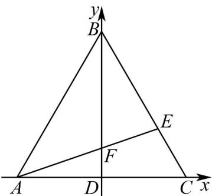

> [!faq]- 《专题06 平面向量的应用（高效培优期中专项训练）数学人教A版高一必修第二册》官方解析
>
> > [!success]- **【答案】** (1)-1 (2) $-\frac{\sqrt{21}}{14}$ (3) $-\frac{7}{3}$
>
> > [!note]- **【解析】**
> > （1）以 $D$ 为坐标原点，建立如图平面直角坐标系，
> >
> > 
> >
> > 由 $AB = 2, AD = DC, BE = 2EC$ ，可得 $A(-1,0), C(1,0), B(0,\sqrt{3})$
> >
> > 由 $\overrightarrow{BE} = 2\overrightarrow{EC}$ 可得 $E\left(\frac{2}{3},\frac{\sqrt{3}}{3}\right)$ ，所以 $\overrightarrow{AE} = \left(\frac{5}{3},\frac{\sqrt{3}}{3}\right),\overrightarrow{BD} = (0, - \sqrt{3})$
> >
> > 则 $\overrightarrow{AE} \cdot \overrightarrow{BD} = \left( \frac{5}{3}, \frac{\sqrt{3}}{3} \right) \cdot (0, -\sqrt{3}) = -1$ ;
> >
> > (2) 由图可得 $\cos \angle AFB = \cos \left\langle AE, BD \right\rangle = \frac{AE \cdot BD}{|AE||BD|} = \frac{-1}{\sqrt{\left(\frac{5}{3}\right)^2 + \left(\frac{\sqrt{3}}{3}\right)^2 \cdot \sqrt{0^2 + (-\sqrt{3})^2}} = -\frac{\sqrt{21}}{14}$ ;
> >
> > (3) 设 $M(x,y)$ ，则 $\overline{MA}=(-1-x,-y),\overline{MB}=(-x,\sqrt{3}-y),\overline{MC}=(1-x,-y)$
> >
> > 所以 $MA \cdot MB + 2MA \cdot MC = x^2 + x + y^2 - \sqrt{3}y + 2(x^2 - 1 + y^2)$
> >
> > $$
> > = 3 x ^ {2} + 3 y ^ {2} + x - \sqrt {3} y - 2 = 3 \left(x ^ {2} + \frac {1}{3} x\right) + 3 \left(y ^ {2} - \frac {\sqrt {3}}{3} y\right) - 2 = 3 \left[ \left(x + \frac {1}{6}\right) ^ {2} + \left(y - \frac {\sqrt {3}}{6}\right) ^ {2} \right] - \frac {7}{3} - \frac {7}{3},
> > $$
> >
> > 当 $x = -\frac{1}{6}$ , $y = \frac{\sqrt{3}}{6}$ 时取“=”号，
> >
> > 所以 $\frac{u}{MA} \cdot \frac{u}{MB} + 2\frac{u}{MA} \cdot \frac{u}{MC}$ 得最小值为 $-\frac{7}{3} \cdot$
