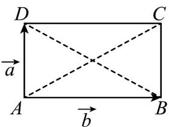

> [!faq]- 《专题06 平面向量的应用（高效培优期中专项训练）数学人教A版高一必修第二册》官方解析
>
> > [!success]- **【答案】** C
>
> > [!note]- **【解析】**
> > 由题意作图如下，设 $AB = b, AD = a$
> >
> > 
> >
> > 故向量 $a + b = AC, a - b = BD$
> >
> > 因为 $\left|a+b\right|=\left|a-b\right|$ ，所以 $\left|AC\right|=\left|BD\right|$ ，则四边形ABCD为矩形，则 $AB\perp AD$
> >
> > 又因为 $\left|a+b\right|=2\left|a\right|$ ，所以 $\left|AC\right|=2\left|AD\right|$ ，则 $\angle ABD=\angle CAB=\frac{\pi}{6}$
> >
> > 故向量 $a + b$ 与 $a - b$ 的夹角为 $\overline{AC},\overline{BD}$ 的夹角，故为 $\frac{2\pi}{3}\cdot$
> >
> > 故选 **C**.
