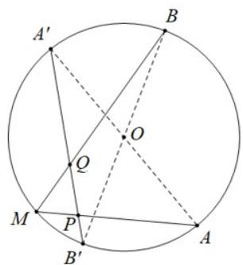
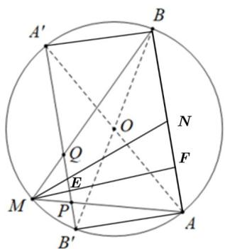

> [!faq]- 《专题06 平面向量的应用（高效培优期中专项训练）数学人教A版高一必修第二册》官方解析
>
> > [!success]- **【答案】**  A. 当 $|MA|=r$ 时，MB为圆的直径； B. $MA \cdot MB = r^{2}$ 时， $OA \cdot MB = 0$ ; C. $\frac{\square\square\square\square}{\square MA\cdot MB}$ 的最大值为 $\frac{\sqrt{6}}{2}r^{2}$ D．作 A、B 的对径点 $A'$ 、 $B'$ ，连接 $A'B'$ 交 MA、MB 于点 P、Q，则 $MP \cdot MQ$ 取得最小值当且仅当 M 为弧 AB 的中点.
>
> > [!note]- **【解析】**
> > 
> >
> > 对于 $^{A}$ ，由正弦定理， $\frac{\left|\overline{MA}\right|}{\sin\angle MBA}=\frac{r}{\sin\angle MBA}=2r$ ，解得 $\sin\angle MBA=\frac{1}{2}$ ，
> >
> > $\because \angle MBA \in (0^{\circ}, 120^{\circ})$ ， $\therefore \angle MBA = 30^{\circ}$ ，又 $\angle AMB = 60^{\circ}$ ，则 $\angle MAB = 90^{\circ}$ ，故 $MB$ 为圆 $O$ 的直径，故 ${}^{A}$ 正确；
> >
> > 对于 $^{B}$ ，由正弦定理， $\frac{\left|\overline{AB}\right|}{\sin\angle AMB}=2r$ ，可得 $\left|\overline{AB}\right|=\sqrt{3}r$ ，
> >
> > 因 $\overline{MA}\cdot MB=\left|\overline{MA}\right|\left|\overline{MB}\right|\cos\angle AMB=\frac{1}{2}\left|\overline{MA}\right|\left|\overline{MB}\right|=r^{2}$ ，可得 $\left|\overline{MA}\right|\left|\overline{MB}\right|=2r^{2}$ ①，
> >
> > 由余弦定理， $\left|AB\right|^{2}=\left|MA\right|^{2}+\left|MB\right|^{2}-\left|MA\right|\left|MB\right|=3r^{2}$ ②，
> >
> > 由①②联立，解得 $\left\{ \begin{array}{l} \left| \overrightarrow{MA} \right| = r \\ \left| \overrightarrow{MB} \right| = 2r \end{array} \right.$ 或 $\left\{ \begin{array}{l} \left| \overrightarrow{MB} \right| = r \\ \left| \overrightarrow{MA} \right| = 2r \end{array} \right.,$
> >
> > 因 $\left|AB\right|=\sqrt{3}r$ ，由 $\left|MB\right|^{2}+\left|AB\right|^{2}=\left|MA\right|^{2}$ ，可得 $MB\perp AB$ ，
> >
> > 则 $OA$ 与 $MB$ 不垂直，即 $\overline{OA} \cdot MB \neq 0$ ，故 ${}^{\mathrm{B}}$ 错误；
> >
> > 对于 $\mathbb{C}$ ，设 $AB$ 中点为 $N$ ，由 $\mathbb{B}$ 项已得 $\left|\overline{AB}\right| = \sqrt{3} r$
> >
> > $$
> > \frac {\square \square \square \square \square \square}{M A \cdot M B} = \frac {\left(\stackrel {{\square \square \square}} {M A} + \stackrel {{\square \square \square}} {M B}\right) ^ {2} - \left(\stackrel {{\square \square \square}} {M A} - \stackrel {{\square \square \square}} {M B}\right) ^ {2}}{4} = \frac {\stackrel {{\square \square \square}} {4 M N} ^ {2} - \stackrel {{\square \square \square}} {B A} ^ {2}}{4} = \stackrel {{\square \square \square}} {M N} ^ {2} - \frac {3 r ^ {2}}{4}
> > $$
> >
> > 由垂径定理， $\left|\overrightarrow{ON}\right|=\sqrt{r^{2}-\left(\frac{\sqrt{3}}{2}r\right)^{2}}=\frac{1}{2}r$ ，则当点M为弧AB的中点时， $\left|MN\right|_{\max}=\frac{1}{2}r+r=\frac{3}{2}r$
> >
> > 故 $\frac{\sqrt{4}}{MA} \cdot \frac{\sqrt{4}}{MB}$ 的最大值为 $\frac{9}{4} r^2 - \frac{3}{4} r^2 = \frac{3}{2} r^2$ ，故 $C$ 错误；
> >
> > 对于 $^{D}$ ，由题意可得四边形 $ABA'B'$ 为矩形，过 M 作 $MF \perp AB$ 于点 F，交 $A'B'$ 于 E，
> >
> > 因 $\angle AOB = 2\angle AMB = 120^{\circ}$ ，可得等边三角形 $OAB^{\prime}$ ，则 $EF = AB' = r$
> >
> > 因 $PQ // AB$ ，则 $\triangle MPQ \sim \triangle MAB$ ，则 $\frac{MP}{MA} = \frac{MQ}{MB} = \frac{ME}{MF} = \frac{ME}{ME + r} = \frac{1}{1 + \frac{r}{ME}}$ （\*），
> >
> > 当 M 为弧 AB 的中点时，取最大值 $r - \frac{1}{2}r = \frac{1}{2}r$ 时， $\frac{1}{1 + \frac{r}{ME}}$ 即 $\frac{ME}{ME + r}$ 取得最大值 $\frac{1}{3}$ ，
> >
> > 又由 $^{C}$ 知，M 为弧 AB 的中点时， $\frac{\square\square\square\square}{\square MA\cdot\square MB}$ 的最大值为 $\frac{3}{2}r^{2}$
> >
> > 由（ $^{*}$ ）可得： $\overrightarrow{MP}\cdot\overrightarrow{MQ}=\left(\frac{ME}{ME+r}\right)^{2}\overrightarrow{MA}\cdot\overrightarrow{MB}$
> >
> > 故当且仅当 M 为弧 AB 的中点时， $MP \cdot MQ$ 取得最大值为 $\frac{1}{9} \times \frac{3}{2} r^{2} = \frac{1}{6} r^{2}$ ，故 D 错误.
> >
> > 故选 **A**.
