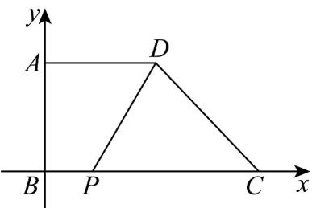
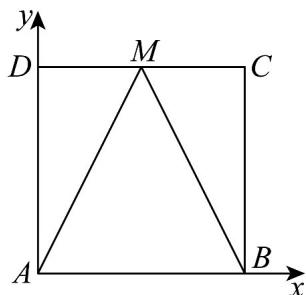

> [!faq]- 《专题06 平面向量的应用（高效培优期中专项训练）数学人教A版高一必修第二册》官方解析
>
> > [!success]- **【答案】** D
>
> > [!note]- **【解析】**
> > 如图示，以 B 为原点， $\overset{\square\square}{BC}$ 为 x 轴正方向， $\overset{\square\square}{BA}$ 为 y 轴正方向建立平面直角坐标系.
> >
> > 
> >
> > 则 $B(0,0), A(0,2), C(2d,0), D(d,2), P(p,0)(0 \leq p \leq 2d)$
> >
> > 所以 $PC = (2d - p, 0)$ ， $PD = (d - p, 2)$ .
> >
> > 所以 $PC + 3PD = (5d - 4p, 6)$
> >
> > 所以 $\left|PC+3PD\right|=\sqrt{(5d-4p)^{2}+6^{2}}$ 6（当且仅当 5d=4p 时等号成立）.
> >
> > 所以 $\left|PC+3PD\right|$ 的最小值是6.
> >
> > 故选：D
> >
> > ## 考点04向量与几何最值
> >
> > 16. 四边形 $ABCD$ 是边长为 1 的正方形， $M$ 是线段 $CD$ 上的动点（包括端点 $C$ 、 $D$ ），则（）
> >
> > 【答案】
> > A. $AM \cdot BC = 1$ B. 当 $AD + MC = AM$ 时， $M$ 为 $CD$ 中点
> > C. $\left|MA + MB\right|$ 的最小值为 $\sqrt{3}$ D. $\left|MA + MB\right|$ 的最大值为 $\sqrt{5}$
> >
> > 【答案】ABD
> >
> > 【详解】以 A 为原点，分别以 AB ， AD 所在直线为 x ， y 轴建立平面直角坐标系，
> >
> > 
> >
> > 因为四边形 $ABCD$ 是边长为 $1$ 的正方形， $M$ 是线段 $CD$ 上的动点（包括端点 $C$ 、 $D$ ）
> >
> > 则 $A(0,0)$ ， $B(1,0)$ ， $C(1,1)$ ， $D(0,1)$ ，设 $M(x,1)(0\leq x\leq 1)$
> >
> > 对于 A， $AM = (x,1)$ ， $BC = (0,1)$ ，所以 $AM \cdot BC = 1$ ，故 A 选项正确；
> >
> > 对于 B， $\overline{AD}=(0,1)$ ， $\overline{MC}=(1-x,0)$ ， $\overline{AM}=(x,1)$ ，由于 $\overline{AD}+\overline{MC}=\overline{AM}$ ，
> >
> > 所以 $1 - x = x$ ，解得 $x = \frac{1}{2}$ ，则 $M$ 为 $CD$ 中点，故 $\mathbf{B}$ 选项正确；
> >
> > 对于 C， $\overline{MA} = (-x, -1)$ ， $\overline{MB} = (1 - x, -1)$ ，则 $\overline{MA} + \overline{MB} = (1 - 2x, -2)$ ，
> >
> > 所以 $\left|\overline{MA}+\overline{MB}\right|=\sqrt{(1-2x)^{2}+4}$ ，则当 $x=\frac{1}{2}$ 时， $\left|\overline{MA}+\overline{MB}\right|$ 的最小值为 $^{2}$ ，故 C 选项不正确；
> >
> > 对于 $^{D}$ ，当 x=0 或 1 时， $\left|MA+MB\right|$ 的最大值为 $\sqrt{5}$ ，故 $^{D}$ 选项正确；
> >
> > 故选 **ABD**
