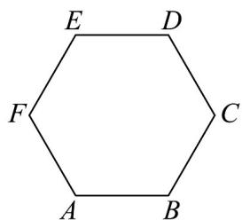

> [!faq]- 《专题06 平面向量的应用（高效培优期中专项训练）数学人教A版高一必修第二册》官方解析
>
> > [!success]- **【答案】**  
>
> > [!note]- **【解析】**
> > 由题意易知 $\angle FAB = 120^{\circ}$ ，则 $AB\cdot AF = |AB|\cdot |AF|\cdot \cos \angle FAB = \cos 120^{\circ} = -\frac{1}{2}$
> >
> > $$
> > \left| \overrightarrow {A M} \right| = \sqrt {\left[ \frac {1}{2} \left(\overrightarrow {A B} + \overrightarrow {A F}\right) \right] ^ {2}} = \sqrt {\frac {1}{4} \left(\overrightarrow {A B} ^ {2} + 2 \overrightarrow {A B} \cdot \overrightarrow {A F} + \overrightarrow {A F} ^ {2}\right)} = \sqrt {\frac {1}{4} \left[ 1 + 2 \times \left(- \frac {1}{2}\right) + 1 \right]} = \frac {1}{2};
> > $$
> >
> > 易知 $AB \perp AE$ ， $AP = \lambda AB + \mu AE$
> >
> > 当 $\overset{\text{UUU}}{AP} = \overset{\text{UUU}}{AC}$ 时， $\lambda$ 取最大值为 $1 + 1 \times \cos 60^{\circ} = \frac{3}{2}$ ，
> >
> > 当 $\stackrel{\square}{AP} = \stackrel{\square}{AF}$ 时， $\lambda$ 取最小值为 $-1 \times \cos 60^{\circ} = -\frac{1}{2}$
> >
> > 所以 $\overline{AP} \cdot \overline{AB} = (\lambda AB + \mu AE) \cdot \overline{AB} = \lambda AB^{2} + \mu AE \cdot AB = \lambda \in \left[-\frac{1}{2}, \frac{3}{2}\right]$ .
> >
> > 故答案为： $\frac{1}{2}$ ； $\left[-\frac{1}{2},\frac{3}{2}\right]$
